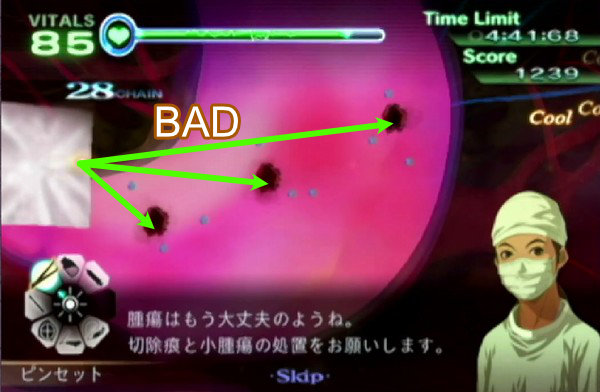
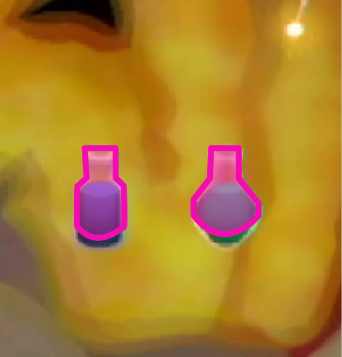

# RTAの基礎知識とテクニック

ここではRTAでタイム短縮に有効な情報を記載します。特に注釈がない限りカドゥケウスZとNEWBLOODの両方で有効となります。

## エピソードセレクトスキップ(ESS)

手術クリア後はエピソード再生中に(+)ボタンからEPISODE SELECTを選択してエピソード選択画面に移動してもクリア扱いになります。**この操作をエピソードセレクトスキップ（以下ESS）と呼びます**。

**手術クリア後のエピソードが極端に短い場合を除いて**基本的にESSを利用していきます。

## ゲームの進行について {#progress}

ほとんどのステージでは**画面上の患部を全て治療しないと次の患部・イベントなどが発生しない**ようになっています。  
※一部の例外は存在します。

危機的状況だからといって次々と患部を治療していくとバイタルを回復する暇もなくゲームオーバーになってしまいます。そこで有効になるのが**裂傷などをひとつだけ残してひたすらバイタルを回復する**ことです。

時間制限があるので常に回復するわけにはいきませんが、それでもこれだけでほとんどのステージでは楽になります。

## 頻出患部の基本処置について

### 裂傷

裂傷はRTAで最も多く出現する患部なので、速く処理できるようになるほどクリアタイムが縮まります。

RTAではCOOL判定を取得する必要はないので、折り返しの回数は少なくしたいです。少なすぎるとBAD判定どころか縫合として認識されないので、**アルファベットのZやWのような軌跡**で縫合するのが速度と判定されやすさが両立しています。

!!! tips "限界まで簡略化してみる"
    下記動画は縫合の折り返しを極端に少なくした例です。これでもCOOL判定まで出すことはできますが、縫合として認識されないことのほうが多いので推奨できません。

    

### 心停止（カウンターショック）

カウンターショックを1度で成功させるには緑エリアで止める必要がありますが、**猶予は2フレーム**という厳しさです。

あまり安定しない時はゲージの上昇中ではなく下降中に止めてみるようにしてみてください。少なくとも著者はこの方法で成功率が跳ね上がりました。

### 腫瘍

出現場所は完全に固定なので、基本的に場所を覚えてエコーなしで切除します。

エコー使用時に縦のガイドラインが見えますが、どの方向でもいいので腫瘍を一直線に切るようにメスを入れることで切り出すことができます。

腫瘍で最も重要なことは、**治療完了判定まで1秒かかる**ということです。

-----

## 治療判定遅延 {#jerry_delay}

一部の患部はCoolやGood判定を出しても治療が終わったと判定されるまで1秒かかるものがあります。

[ゲームの進行について](#progress)の通り、画面上の全ての患部を治療してから次のイベントなどが発生する仕様になっています。そしてこの判定遅延が最後に発生した場合、**次のイベント発生まで1秒待つことになります**。

ゲーム全体に頻出する腫瘍の切除痕などの人工膜を利用する患部やギルスやスティグマなどが対象なので、忘れずに早めに処理するようにしましょう。

  
▲最後の患部を同時に処理した場合の比較。人工膜を最後にするとちょうど1秒遅延している。

-----

## バイタルダメージの種類について

### 持続ダメージ

DoT（Damage over Time）とも呼ばれるもので、時間経過で少しずつバイタルが減少するダメージを指します。

患部の種類によって減少量は異なります。一つ一つのダメージ量が少なくても数が集まることで無視できないダメージ量になります。

処置に時間がかかるほど、その間に受けるバイタルダメージが大きくなります。逆に言えば**操作が早ければ早いほど受けるダメージが少なくなる**ので、カドゥケウスRTAではいかに操作を最適化して素早く処置することによりバイタルダメージを減らし、回復行動による時間の浪費を減らすかが重要になります。

また、**裂傷にヒールゼリーを塗ると極わずかな間だけ持続ダメージが停止します**。画面上の裂傷の数が多い上にバイタルがピンチになるような場合は、回復役を注射しようとすると手遅れになる場合もあるので、まずはゼリーでバイタルの減少を止めましょう。

### 即時ダメージ

持続ダメージとは別に、特定の処置を行った時などに固定で受けるダメージです。

例えば、腫瘍をメスで切除した時は固定で3ダメージ、内出血の切除時は5ダメージ、閉創時の縫合やテーピングをミスした場合は5ダメージを受けます。  
※ゲームタイトル、難易度等で変動します

この固定ダメージの数値から、事前にどれぐらいバイタルを回復しておけば以降の回復が不要になるかを計算することが重要です。患部が残っている時に回復薬を注射すると持続ダメージ分の回復量が無駄になってしまいます。

  
▲腫瘍の切除時にバイタルが3減少している

### 器具ダメージ

メス限定で、メスに切り替えてAボタンを押して使用している間だけバイタルが徐々に減少します。

例えば、腫瘍の切除もガイドラインをうまくなぞれなければ余分にダメージを受けてしまいます。

### 超執刀中のダメージ

時間の流れを遅くする超執刀でも即時ダメージは当然受けますし、持続ダメージも緩やかながら受けてしまいます。無敵ではないのです。

### 即死ダメージの回避について

一気にバイタルが0になる即時ダメージを受けたとしても、即ゲームオーバーにはならず、バイタルゲージが徐々に減少していって0未満になった時点で初めてゲームオーバーとして扱われます。

例えば、カドゥケウスZのラスボスは特殊条件下だとバイタルに30の固定ダメージを与えてきますが、ゲージ減少中に回復薬を注射して最終的なバイタルが0を上回ればゲームオーバーを回避できます。（MOTHERシリーズのHPのようなシステム）

利用する機会はほとんどありませんが、覚えておくと役に立つかもしれません。

-----

## バイタル回復について

主なバイタル回復の手段はバイタル注射とヒールゼリーの2種類です。

### 回復薬（注射）

回復には下記手順が必要になります。

1. ポインタを回復薬へ合わせる
2. 注射器へ充填（じゅうてん）するる
3. 注射する
4. 注射器が空になるまで投与する

この4アクションが必要になり、最大値の12を回復させる場合はおよそ1.2～1.4秒要してしまいます。

充填が自動ではなく完全に手動なので、慣れていなかったり、慌てていたりすると意外と時間がかかってしまいます。回復薬をいつ使うかをパターン化しておくなどしてスムーズに回復できるようにしたいです。

### ヒールゼリー

回復量は回復薬には及ばないものの、バイタルを1～2だけ回復するなら**注射器よりも早く回復できる**のが特徴です。

一部のステージでは、ヒールゼリーを隙間時間にいかに挟めるかどうかでタイム短縮につながることもあります。

-----

### ピンセットのトレイ判定

カドゥケウスZとNEW BLOODでは、どちらのゲームでも**ポインタが完全にトレイの上に乗っていれば間違いなくOKが出ます**。トレイの外側の受け付け可能な判定の大きさが異なっています。

#### カドゥケウスZ

トレイの外側の判定はやや狭めです。左側に至ってはほぼ判定がないので注意しましょう。特にテタルティでは何度も楔を落としてしまうと間に合わなくなってしまうので、ギリギリを狙わずに抜いていきたいです。

#### カドゥケウス NEW BLOOD

Zと異なりトレイの外側の判定がかなり大きくなりました。掴んだ物体の端がトレイに重なっていればOKと思ってもらって大丈夫です。

### 人工膜の設置判定

#### カドゥケウスZ

掴んだ人工膜の端が切除痕の外周よりもやや内側に重ならないと設置されません。例外として**上方向だけは許容範囲がかなり広くなっています**。

ピンセット同様ですが、人工膜を切除痕の上にしっかり乗せれば問題ありません。ギリギリを狙うと落としやすいので注意しましょう。

#### カドゥケウスNB

Zと基本的に同じですが、上方向の許容範囲が狭くなって見た目通りになりました。

#### 人工膜設置のコツ

ポインタを摘出痕の**中心ではなく上を目指して**移動させると安定しやすいです。

-----

## 手術器具について

### メスの手ブレ補正

メスを使用している時は**ポインタの手ぶれ補正が強くなります**。結果的にポインタの動きが普段と比べて遅くなるので、長い距離を切除する場合は念頭に入れて操作しましょう。

### 注射器の判定

注射器に薬剤を充填する時に表示されるビンのアイコンは、**アイコン下部の影の部分には判定がありません**。

炎症剤等の薬品を充填しようとして影の部分をAボタンを押してしまうと当然ミス扱いになるので注意しましょう。

### 器具の耐久力

ZとNBでは器具の耐久力がそれぞれ異なります。下記表はレーザーを押しっぱなしで使用した場合のアイコンの変化に要するフレーム数（60フレームで1秒）です。

&nbsp; | Z | NB
- | -: | -:
白から黄(100%->50%)                        | 165f | 192f
黄から赤(50%->25%)                        | 72f | 96f
赤から破損(25%->0%)                      | 69f | 96f
合計使用可能時間                   | 306f | 384f
**破損から復活**                | **181f** | **181f**
黄から白まで回復 (25%～50%) | 136f | 136f

<!--
※Z: 赤アイコン状態で67フレーム使用してから黄アイコンに戻るまで140フレーム（消費の2倍の回復時間）
※NB: 赤アイコン状態で45フレーム使用してから黄アイコンに戻るまで64フレーム（消費の約1.5倍の回復時間）
-->

- ZよりNBのほうが器具の耐久力が約1.3秒多い
- ZとNB共通で**破損から復活までは3秒**
- ZとNB共通でアイコンの色が赤になったら**使い切ってしまったほうが**回復に必要な時間は短い

黄から白まで、つまり残り25%から50%までの自然回復に必要な時間が約2.2秒(136フレーム)ということから、アイコンが赤になった時点で**わざと耐久力を使い切ってから復活させたほうが回復に必要な時間は短くなります**。

当然3秒間は使用不可能になりますが、ギルスやスティグマの無敵時間等に合わせたり、その間に超執刀を使ったり回復するなどすれば無駄ではなくなります。

!!! tips "使用不可能アイコンに注意"
    器具が使用不可能になってから復活するまでは上記の通り181フレーム必要ですが、復活してからも19フレームの間は使用不可能アイコンのままになっています。つまりアイコンで使用可能かどうか判断しているとそれだけで約0.3秒ロスしてしまうので、復活しそうだったら器具を再使用する準備をしておきましょう。
    

### ツールグリッチ

Z・NBの両方で使用可能なテクニックで、全ての器具は耐久力が0になって使用できない状態になっていても**超執刀未使用時**に限って**ZまたはCボタンを押しながらAボタンを押すと1フレームだけ使用することができます**。

Aボタンを押しっぱなしにすることで使用する器具（縫合・エコー・ピンセット、注射）では意味がありませんが、ドレーン、ゼリー、メス、レーザーの3つでは効果を発揮します。

ごく一部のステージで有効利用できるため、詳しくは該当ステージにてご確認ください。

### 超執刀発動のタイミングを調整する

超執刀を発動する際に、星だけ描いておいてボタンを離さないで押しっぱなしのままにしておくと、発動せずにそのまま待機できます。

任意のタイミングで超執刀を発動できるので、ごく一部のステージ役に立ちます。

▲処理落ち回避のために血飛沫が消えるのを待っている状態

### 心細動中に器具を使う

カドゥケウス NEW BLOODで利用可能なテクニックです。

心細動が発生してから心停止になるまでの間は手術器具を使用してもミス扱いになりますが、実は1フレームだけ器具の効果が発揮するので無理やり患部の処置を進めることができます。

ミス扱いなので当然バイタルが減少してしまう点には注意が必要です。

