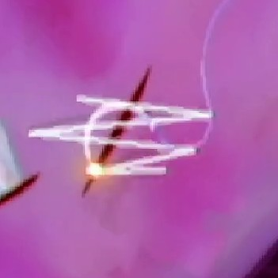
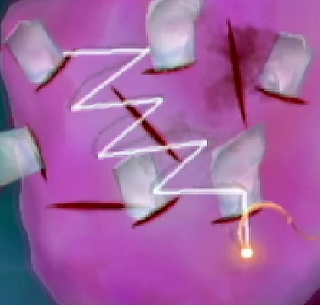
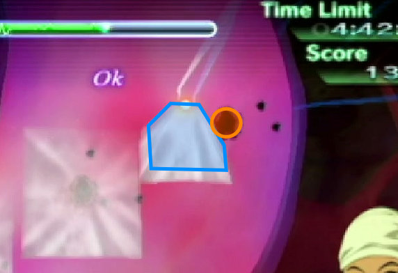
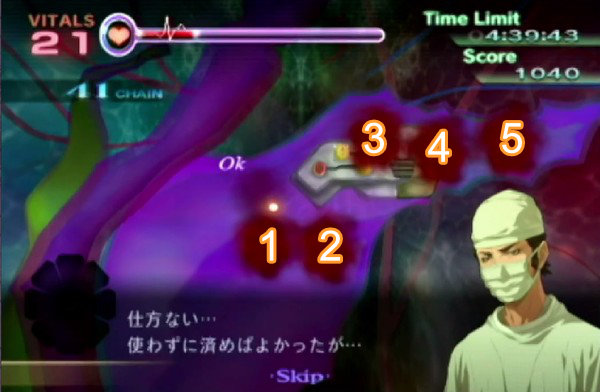
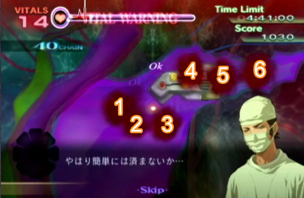
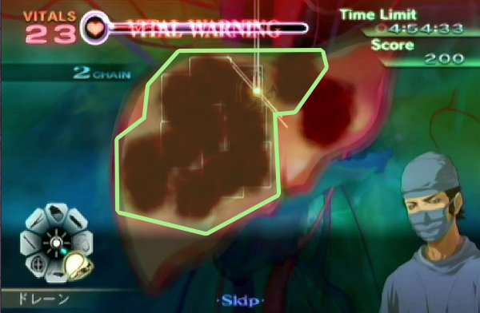
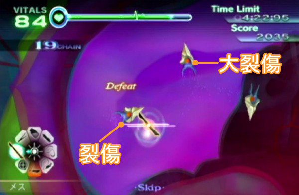

# カドゥケウス NEW BLOOD All Operation XS Rank RTAチャート

2025/9/29に2時間26分2秒の記録を出しました。

[カドゥケウス NEW BLOOD All Operation XS Rank Speedrun 2:26:02.36 (WiiU)](https://youtu.be/GxM_6L6RPog)

## はじめに

## All Operation XS Rank カテゴリのルール

- 全50ステージでXSランクを取得する
- 各ステージで使用キャラは不問
- タイマースタートはAny%と同じ
- タイマーストップはエピソード選択画面で最後のXSマークが表示された瞬間

## スコアについて

裂傷を縫合したりすると即座に得られる**ステージスコア**と、クリア後のリザルト画面で得られる**ボーナススコア**、その2種類を足したものが最終スコアとしてXS評価の判定に用いられる。

### 治療時に得られるステージスコア

普通にXSを取得するだけなら下記スコアを**覚える必要はない**。最終的にXSを取得した上で**いかにして最後のテーピングと回復を省くか**、になるので、その際のスコア計算時に必要になる。

&nbsp; | BAD | GOOD | COOL | OK
:-: | :-: | :-: | :-: | :-:
縫合 | 40 | 70 | 120 | -
縫合（閉創）| - | 150 | 240 | -
テーピング | 100 | 180 | 260 | -
炎症（大・小） | - | - | - | 40

!!! tips "稼ぎ防止"
    スティグマ等に生成された裂傷や一部ステージの出血などは無限に稼げてしまうので、スコアが一律10ptsに設定されている。ただし膿から発生する炎症だけは例外でスコアが40ptsのままに設定されているので特定のステージで稼ぎに利用することができる。

### 通常ステージのボーナススコア

&nbsp; | ボーナス1.0倍 | ボーナス2.0倍
:-: | - | -
バイタル | 1バイタルにつき5pts | 1バイタルにつき**10pts**
残り時間 | 1秒につき5pts | 1秒につき**10pts**
MAX CHAIN | 1CHAINにつき5pt | 1CHAINにつき**10pt**

※残り時間は0.2秒ごとに1pts計算、分かりやすくするために秒単位で記載

!!! tips "テーピングするかどうか"
    テーピングとバイタル回復2回は所要時間がほぼ同じ約2.6秒となる。テーピングをCOOLで終わらせると260ptsと2CHAINが上乗せされて実質280pts、バイタル回復2回は240ptsとなる。
    
    スコアだけを見るならテーピングすべきだが、閉創部が大きいと消毒に時間がかかったり、GOOD判定で終わらせてしまうこともあるので、基本的にはバイタル回復によるスコア稼ぎを優先したい。

### スコアアタックステージのボーナスボーナス

&nbsp; | ボーナス1.0倍 | ボーナス1.5倍
:-: | - | -
バイタル | 1バイタルにつき5pts | 1バイタルにつき**7.5pts**
残り時間 | 1秒につき5pts | 1秒につき**7.5pts**
MAX CHAIN | 1CHAINにつき5pt | 1CHAINにつき**7.5pt**
COOL判定数 | 1COOLにつき100pt | 1COOLにつき**150pt**
GOOD判定数 | 1GOODにつき50pt | 1GOODにつき**75pt**
処置患者数 | 1人につき1000pt | 1人につき**1500pt**

※残り時間は0.2秒ごとに1pts計算、分かりやすくするために秒単位で記載

通常ステージよりもバイタル等のボーナスが減少しているかわりにCOOLとGOOD判定の大きなスコアボーナスが追加されている。

COOL・GOOD判定の上記のスコアはステージスコアは別となっているので、実際には下記の通り125点の差が出てしまう。

縫合の判定 | ステージ | ボーナス | 合計
:-: | -: | -: | -:
COOL | 120 | 150 | 270
GOOD | 70 | 75 | 145

GOOD判定を出しすぎるとテーピング前の全回復に時間を取られるだけでなく、ステージによっては別途稼ぎが必要になるので、可能な限りCOOL判定を取り続けるように心がけたい。

-----

## 各種判定について

### MISSについて

下記行動についてもMISS扱いとなりスペシャルボーナスを逃してしまう

- メスで治療できる幹部がないところでメスを一定距離以上使用した場合（裂傷が生成される）
- メス同様に何もないところでレーザーを照射し続けた場合（炎症痕が生成される）

### バイタルをX以下に下げない

1-2では「バイタルを75以下に下げない」という条件が設定されている。

基礎知識でも書いた通り**表示されているバイタルの数字は整数部のみ**なので、小数点以下の数値が存在する。

つまり、バイタル表示が75だとしても内部ではバイタル75.1という状態であればXS条件を満たすことができるので、リトライせずにそのまま手術を続行する。

### 縫合のCOOL判定について

縫合に関しては完全に私個人の経験だが、下記のようなシステムになっていると思われる。

1. 裂傷の種類毎に評価スコアが設定されていて、一定スコア以上でCOOL判定になる
2. スコアは、裂傷に対する縫合の角度、縫合始点から裂傷までの距離が離れすぎていないか、折り返しも裂傷から離れすぎていないか、折り返しの回数、で評価される
3. 糸を複数回折り返すとそれだけスコアが加算される = COOL判定になりやすい
4. 縫合の始点と終点が裂傷の始点と終点から離れすぎていると縫合として判定されなくなる

#### 折り返しを増やす

COOL判定に近づけるための最も確実な方法は、縫合の折り返しの回数を増やすこと。

折り返しを増やすメリットはスコア以外にも存在する。Wiiリモコンのポインタを速く小さく動かしすぎるとゲーム側が縫合の折り返しポイントとして認識してくれないことがそれなりに発生しまう。

縫合の折り返しポイントがなくなるということは雑な縫合として認識されてしまってGOODやBAD判定として取られてしまうので、それを防ぐためにも折り返しの回数は気持ち多めにしておくとCOOL判定が取りやすくなる。

#### 重なり合った裂傷

裂傷に対して縫合全体のサイズが小さかったり折り返しの回数が少なかったりすると、目的とは別の裂傷の縫合として判定されてしまうことがある。そうなると折り返しの位置がほとんど合わずに適当な縫合として見られてしまう。

こういった事故を避ける為にも重なり合った裂傷は折り返しの回数を増やしたり、縫合の始点と終点を裂傷の始点と終点になるべく近づけることで誤認識され辛くなる。

#### ダメな例：ポインタの動きが小さい

ポインタの動きが小さいと折り返しのポイントとして認識され辛くなってしまう。

小さい裂傷にたいして下記画像ぐらいの幅で縫合してもまったく問題ないので縫合は大きめに縫おう。

#### ダメな例：始点が遠い

下記画像のような縫い方はマイナス判定を受けてしまう。縫合の始点は裂傷の近くから始めよう。

#### 閉創について

閉創は必要スコアが高めに設定されているので最低でも3～4往復はさせないとCOOL判定を出すのは難しい。

!!! tips "大裂傷について"
    カドゥケウスZの大裂傷でCOOL判定を出すには閉創と同じくらいの折り返し回数で縫合しなければならなかったが、ニューブラッドでは普通の裂傷と同じ折り返し回数でCOOL判定が出るようになった。

### テーピングの判定について

**閉創痕に対して平行である**ほどCOOL判定となりやすい。並行ならば始点が多少ずれていても、またテーピングが多少長くても問題ない。

この動画は極端な例だがこれでもCOOL判定となる。これ以上離れるとそもそもテープが閉創痕に届かなくなるのでミスとなる。

### ピンセットの設置判定について

ピンセットで掴めるほとんどのものは、掴んだ物の端がトレイに少しでも重なった状態なら置くことができる。

### ピンセットの設置判定について（人工膜）

人工膜は設置判定自体が見た目よりも**やや狭くなっている**。

実際の判定は見た目よりもやや狭くなっていて、さらにポインターの下側に判定が広がっているので、切除痕の中心からやや下に設置しようとするとミスになりやすい。

人工膜を高速設置する場合は切除痕の中心ではなく、中心からやや上を目指すと設置が安定しやすい。

-----

## 各ステージXS取得チャート

### 1-1 極北の町で

- キャラ選択：どちらでも
- クリア前回復：不要
- テーピング：**COOL**

#### XS 条件

- スコア**6000**以上
- MISS判定無し
- **4分**以上残して手術終了
- MAX CHAIN**40**以上
- COOL判定**12**回以上取得

#### 最初の回復

手術開始時にバイタルを回復されるように指示される。操作可能になる前から回復薬の瓶にポインタを合わせておいて、注射器フル充填の回復を行わないと再度回復が必要になるくらいにはバイタルの減少が激しい。

下記はカーソルを合わせていたもののボタンを押すタイミングが遅れた例。これでも遅いのである。

#### COOL判定12回以上取得

COOL判定を出せるのは【縫合4、切開1、ガラス片6、閉創1、テーピング1】の合計13箇所なのでGOOD以下の判定を2回出した時点でリトライ確定となる。

主にガラス片でGOOD以下の判定を出しやすいので時間がかかってもいいから慎重に**傷口に対して垂直に**抜こう。BADが出てしまった場合はCHAINが足りなくなるのでこちらもリトライ確定となる。

#### 骨片の判定

骨片は傷口に対して垂直に抜くことでCOOL判定となる。画像のガイドを目安に多少時間をかけてもいいので確実にCOOLを取りに行く。

-----

### 1-2 モンゴメリ記念病院の風景

- キャラ選択：どちらでも
- クリア前回復：不要
- テーピング：**COOL**

#### XS 条件

- スコア**5950**以上
- MISS判定無し
- **4分**以上残して手術終了
- MAX CHAIN**50**以上
- バイタルを**75**以下に下げない

#### 腫瘍に注意

バイタル表示が74以下になった途端にリトライ確定となる。（75表示の場合は小数点以下が見えないだけでまだ75以下にはなっていない）

腫瘍と炎症の固定ダメージに気をつけなければならない。腫瘍は切除した際に固定で3ダメージ、炎症をレーザーで焼いた際に固定で1ダメージを受けてしまう。

腫瘍パートに入ったらまずは回復して、切除、レーザーの手順毎にバイタルを確認して回復すれば問題はない。

また、腫瘍をエコーで特定してしまうとGOOD判定になるので絶対に特定しないようにする。エコーで一瞬影を映すだけなら問題はない。

-----

### 1-3 ブリザード

- キャラ選択：どちらでも
- クリア前回復：不要
- テーピング：**COOL**

#### XS条件

- スコア**5000**以上
- MISS判定無し
- **4分20秒**以上残して手術終了
- カウンターショックの回数**2**回以下
- COOL判定**5**回以上取得

#### 攻略

カウンターショックが2回まで、という制限がやや辛いぐらいで特に難しくないステージ。無理にゲージの緑部分を狙う必要はないので灰色のゾーンで2回止めるのを目指す。

-----

### 1-4 救いの妖術 {#e14}

- キャラ選択：マーカス固定
- クリア前回復：**全快**
- テーピング：無し

#### XS条件

- スコア**5200**以上
- MISS判定無し
- **4分15秒**以上残して手術終了
- MAX CHAIN**45**以上
- 血だまりの発生回数**18**回以下

#### チップ設置について

Any%同様に一番左のソケットには設置しないようにしよう。また穴とピッタリ合わせるよりもやや右上にずらしたほうが入りやすいというか、穴とピッタリ合わせるとミスの頻度が上がっているような気がする。

#### 出血と血溜まりの処理について

血溜まりを処理する前に全体に広がっている出血をゼリーで処理する。もし出血から血溜まりに変化した場合はミス判定ではないもののCHAINが切れるのでXSを取得することができなくなる。

出血の処理が終わったら、**バイタルを99まで回復してから**血溜まりをまとめて吸い上げる。12個吸い上げると超執刀イベントが始まり、**画面上に残っている血溜まりの個数でXSが取得可能かどうか**を判断することができる。

#### 血溜まりパターンA（XS取得可能）

イベント発生時に画面上に血溜まりが**5個**残っていた場合は追加の血溜まりが発生しなかったことになる。操作可能になってから血溜まりが1個出現するが、これが18個目の血溜まりなので問題ない。

#### 血溜まりパターンB（XS失敗）

イベント発生時に画面上に血溜まりが**6個**残っていた場合は余分な血溜まりが追加で1個発生したことになる。この状態では操作可能になってから血溜まりを1つ吸うと19個目の血溜まりが発生するのが確定しているのでXSの条件を逃してしまう。

**画面上の血溜まりの数を確認して6個だったらすぐにリトライしなければならない。**

#### その後

無事にパターンAを引けたらバイタルを全快させてからクリアすることでXSが取得できる。

-----

### 1-5 老いゆく病院

- キャラ選択：**マーカス**
- クリア前回復：**全快**
- テーピング：**COOL**

#### XS条件

- スコア**6800**以上
- MISS判定無し
- **3分15秒**以上残して手術終了
- MAX CHAIN**52**以上
- バイタルを**55**以下に下げない

#### バイタルを55以下に下げない

一番ネックになるであろう条件。ハードモードなのでバイタルの減りはかなり激しく、いつの間にか55以下になっていることも珍しくない。

スクロール可能になってからすぐにマーカスの超執刀を使ってバイタルの減少を抑え、その間に可能な限り炎症を処理していく。途中バイタル回復を1～2回挟む必要があるので、できるだけ炎症の数が少なくなった後半に行いたい。

#### 注射でミスしないように

炎症の判定はとても小さい。さらに基礎知識でも記述した通り、消炎剤のビンは底に判定がないので補充しようとしてミスしてしまうという事故も発生する可能性がある。多少タイムが遅くなっても確実にクリアしたい。

-----

### 1-6 目覚める奇跡

- キャラ選択：ヴァレリー固定
- クリア前回復：**全快**
- テーピング：**COOL**

#### XS条件

- スコア**8100**以上
- MISS判定無し
- **3分40秒**以上残して手術終了
- MAX CHAIN**70**以上
- 心臓破裂回数**2**回以下

#### バイタルに注意

ハードモードになったおかげでバイタルの自然現象だけでなく内出血を切り出した際のダメージも増加している。

内出血は切り出さずに放置するだけでも自然現象ダメージが大きいので最優先でメスを入れて切り出さなければならない。

内出血を1つ切り出す毎にメスのダメージも含めてバイタルが8減少してしまう。特に心臓部後半では内出血が4つ出現するので全て切り出すだけでバイタルを約32減らされてしまう。

裂傷は全て縫合せずに一つだけ残した状態でバイタルを回復してから追加の内出血を出現させる。

#### 超執刀イベント後

大量の裂傷があらわれるせいで縫合した時に重なり合った別の裂傷に判定が吸われやすい。スコアは割と余裕があるもののBAD判定を出してしまったらリトライしなければならなくなるので慎重に縫合する。

-----

### A-1 スコアアタック1

- キャラ選択：**ヴァレリー**
- クリア前回復：**全快**
- テーピング：**COOL**

#### XS条件

- スコア**30000**以上

#### 一人目

ガラス片と裂傷が大量に発生している。裂傷がかなり小さいせいで縫合の折り返しがうまく重ならずにGOOD判定に化けてしまいやすい。ガラス片もあるので一人目では時間をかけてフルCHAINを目指さずにミスせずにプレイすることだけを心がける。

一応、縫合の判定はCOOLとGOODの間に**125点のスコア差が存在する**のでGOODを出し過ぎたらXS取得が遠のくことは忘れないでおく。

#### 二人目

大量の炎症と腫瘍が発生しており、さらに炎症を治療すると追加の腫瘍が、腫瘍を治療すると追加の炎症が発生する。さらに腫瘍は摘出時に小炎症を5つ発生させる。

腫瘍6個x3=18ダメージ、小炎症5x6=30ダメージ、つまり腫瘍を処理するだけで48ダメージを受ける。当然それらに加えて炎症も含めたバイタル減少量は余裕で100を越えてしまう。

そこで、ヴァレリーの超執刀を使ってバイタルダメージを回避する。

最初に炎症のみを処理した後に超執刀を使用して腫瘍→炎症の順に処理する。途中で超執刀は切れてしまうがそれでもダメージを30～40程度にまで抑えることができる。

また、この時に小炎症がCHAIN表示や超執刀ゲージの真下に隠れてしまうことが稀にあるので余裕があれば炎症の数をカウントして足りないような場合は隠れているはずなのでレーザーを当てておく。

#### 三人目

処理を進めると次々と裂傷等が生成されて固定のバイタルダメージを受けてしまう。

術野内の裂傷を全て縫合したのを条件として次の患部が登場し、固定で20のダメージを受ける。この患部追加は合計3回まで発生する。

条件カウントは裂傷のみで出血はカウントされないので、出血を残しておいて後からまとめて処理することも可能だが、放置する時間が長いと血溜まりに変化してCHAINが切れてしまうことに注意する。

#### XS取得について

スコアには割と余裕があるので例え二人目のテーピングでCHAINが切れてしまったとしてもCOOL判定を取得し続けていればスコアは30000に届く。

1-4に続いて二人目の炎症でミスしやすい。ここを安全に突破できれば再走率がかなり下がるのでゆっくりでも確実にクリアしたい。

-----

### 2-1 冷たい歓迎

- キャラ選択：**ヴァレリー**
- クリア前回復：**60程度まで**
- テーピング：**COOL**

#### XS条件

- スコア**6500**以上
- MISS判定無し
- **3分20秒**以上残して手術終了
- MAX CHAIN**75**以上
- 膿の発生回数**50**回以下

#### CHAINが足りない

マーカスの超執刀を使って一気にクリアしてしまいたくなるが、そうすると膿の増殖が最小限に抑えられてしまってMAX CHAINが足りなくなる。

ここではヴァレリーの超執刀で腫瘍のダメージを回避しつつバイタル回復時間を省く。スクロール可能になったら超執刀を使って普通にクリアするだけで必要なCHAIN数に到達する。

#### 腫瘍の位置について

スクロール可能になってから真っ先に膿を吸い取ってしまうと腫瘍の位置の把握が少し困難になる。膿を目印にして腫瘍を切り出していく。

-----

### 2-2 ペースメーカー

- キャラ選択：どちらでも
- クリア前回復：**全快**
- テーピング：**COOL**

#### XS条件

- スコア**5300**以上
- MISS判定無し
- **3分30秒**以上残して手術終了
- MAX CHAIN**55**以上
- 心臓マッサージの回数**26**回以

#### CHAINが足りない

ペースメーカー交換中の心細動は「取り外し前」「交換中」「取り付け後」の合計3回発生し、そのうちの「交換中」のみランダムで発生しない時がある。

交換中に心細動が発生せず、前後2回の心臓マッサージを全てCOOL判定で済ませてしまうとCHAINが足りなくなる。当然ペースメーカー交換を素早く終えられた時も同様に足りなくなる。

そこで、心細動が発生してもしなくても問題なくなるように**最初の心臓マッサージではわざとGOOD判定のみを取得する**。

#### 心臓マッサージ

##### 心細動が合計2回の場合

1. 「取り外し前」でGOODを12回
2. 「取り付け後」で**GOODを4回**、COOLを4回

丁度55CHAINでクリアすることができる。

##### 心細動が合計3回の場合

1. 「取り外し前」でGOODを12回
2. 「交換中」でCOOLを6回
3. 「取り付け後」でCOOLを6回

合計62CHAINでクリアすることができる。

!!! tips "ペースメーカー交換完了直後"
    画面が切り替わるまで数秒の余裕があるのでバイタル回復を行う

-----

### 2-3 頼りになる者

- キャラ選択：**ヴァレリー**
- クリア前回復：不要
- テーピング：**COOL**

#### XS条件

- スコア**6800**以上
- MISS判定無し
- **3分10秒**以上残して手術終了
- MAX CHAIN**48**以上
- カウンターショックの回数**3**回以下

#### カウンターショックの回数3回以下

手術開始直後と中盤にそれぞれ心停止してしまう都合上、最初の心停止ではカウンターショックを1度で成功させなくてはならない。失敗してしまったら即リトライする。

#### バイタルに注意

蘇生後は治療を進めると裂傷や血溜まりが次々と発生する。そのうちの裂傷は心臓の手術ということもあってバイタルの自然減少量がかなり高く設定されているので最優先で縫合する。ここでヒールゼリーの止血効果が役に立つ。

2度目のカウンターショックを無事に終えることができたらイベント中にヴァレリーの超執刀を使ってから手術を終わらせる。

-----

### 2-4 スティグマ

- キャラ選択：どちらでも
- クリア前回復：**全快**
- テーピング：**COOL**

#### XS条件

- スコア**6400**以上
- MISS判定無し
- **2分30秒**以上残して手術終了
- MAX CHAIN**23**以上
- COOL判定**8**回以上

#### COOL判定8回以上

COOL判定が出る部位は「切開1、縫合5、閉創1、テーピング1」の合計8箇所、つまりGOODは一つも許されないことになる。

最後のテーピングでGOODを出してしまう可能性を考慮してケイルにわざと裂傷を一つ生成させる。数秒ロスしてしまうがこれでXS取得が安定する。

-----

### 2-5 秘密は炎に燃え

- キャラ選択：**ヴァレリー**
- クリア前回復：不要
- テーピング：なし

#### XS条件

- スコア**5400**以上
- MISS判定無し
- **2分30秒**以上残して手術終了
- MAX CHAIN**160**以上
- 血だまりの発生回数**25**回以下

#### いつも通りに

ハードモードでも基本的にはノーマルと変わらない。バイタルの減りがやや多くなった程度なのでヴァレリーの超執刀でメスのダメージを抑えつつ処理を進める。

どうしても培養皮膚を乗せる時に血溜まりが発生してしまうようならヴァレリーではなくマーカスの超執刀を使う。マーカスの超執刀中なら血溜まりの発生頻度をかなり抑えることができるのでバイタル回復の手間は発生するものの安全に進めることができる。

-----

### 3-1 新興難病対策チーム

- キャラ選択：**マーカス**
- クリア前回復：**全快**
- テーピング：**COOL**

#### XS条件

- スコア**4900**以上
- MISS判定無し
- **4分**以上残して手術終了
- MAX CHAIN**30**以上
- 総胆管を通過した胆石**1**個以下

#### 超執刀のタイミングに注意

最初の胆石が流れてくるのは切開の3秒後なので、右上のタイマーを注視しつつ星を描いて待機して3秒経過したら発動する。

後は通常通りクリアするだけだがスコアの条件がちょっとギリギリなので、ちゃんと回復してCOOLテーピングでフィニッシュする。

-----

### 3-2 質疑応答

- キャラ選択：**ヴァレリー**
- クリア前回復：**全快**
- テーピング：**COOL**

#### XS条件

- スコア**7600**以上
- MISS判定無し
- **3分45秒**以上残して手術終了
- MAX CHAIN**65**以上
- COOL判定**8**回以上取得

#### 出血に注意

切開後にヴァレリーの超執刀を使用して後はいつもどおりと言いたいが、出血が血溜まりになるまでの時間がやや短めに設定されているので急いで処置を進めたい。

そしてスコアがギリギリなのでGood判定を何度も出してしまうとそれだけでスコア条件を達成できずにXSを逃してしまうことがある。急ぎつつ縫合はしっかり行わなければならないステージとなっている。

-----

### 3-3 共同研究

- キャラ選択：**マーカス**
- クリア前回復：不要
- テーピング：**COOL**

#### XS条件

- スコア**5500**
- MISS判定無し
- **4分30秒**以上残して手術終了
- MAX CHAIN**11**以上
- 心停止発生回数**1**回以下

#### スコアがギリギリ

通常プレイ同様にマーカスの超執刀を使用した上でパッチを貼るだけだが、パッチの角度が甘くてGood判定になってしまった場合はスコアが微妙に足りずにXS条件を満たせなくなってしまう。その際はバイタルを99まで回復しなければならない。

-----

### 3-4 忌まわしき痕

- キャラ選択：**マーカス**
- クリア前回復：**全快**
- テーピング：**COOL**

#### XS条件

- スコア**5750**以上
- MISS判定無し
- **3分10秒**以上残して手術終了
- MAX CHAIN**60**以上
- 硬化した組織の数**2**個以下

#### XS攻略

赤い腫瘍の生成頻度が短くなっている上にソーマ自体へのドレーンに必要な時間も増えているのでノーマルと同じ感覚でプレイするとミスしてしやすい。

レーザーで3回OKを出した後に出てくるダミーについてはノーマル同様に放置してしまうとかえって時間が掛かってしまうようになっているので、基本に忠実にダミーの後に本物を処理する。

コアの耐久力が1になったらダミーは無視して本体を優先して吸い上げ、コア露出時に合わせてマーカスの超執刀を発動してまとめて処理することで若干ながらの短縮となる。

-----

### 3-5 DHS副総監

- キャラ選択：**マーカス**
- クリア前回復：15以上
- テーピング：なし

#### XS条件

- スコア**7700**
- MISS判定無し
- **2分40秒**以上残して手術終了
- MAX CHAIN**85**以上
- 動脈瘤を破裂させない

#### 動脈瘤を破裂させない

Any%ノーマルではヴァレリーの超執刀を使って破裂上等なプレイをしていたが、破裂させてしまうとXSを逃してしまうのでマーカスの超執刀を使って破裂させないように手術を進めていく。

ハードモードになって変わったのは、動脈瘤が膨らむ速度が早くなっている＝完全収縮に必要な収縮剤の量が増えている、といった程度で基本的にやることは変わらない。

#### 前半

動脈瘤が2つ同時に出現するシーンでは難易度ノーマルと異なってフル充填した注射器一本で2つの動脈瘤を収縮し切ることが困難になっている。

およそ注射器1.1本分程度の収縮剤が必要なので、片方を収縮させたらほんの少しだけ充填してからもう一つを収縮させる。

#### 後半

4つ同時に出現するシーンではマーカスの超執刀を使って4つ全て切除まで進めてしまえば破裂することはなくなる。超執刀中であれば収縮が元に戻る速度が遅いのでフル充填した注射器一本で2つの動脈瘤を収縮させることが可能だ。

#### スコアについて

GOODを2つ以上出したりバイタルの残りが1桁になっているような場合は念の為10程度回復しておく。

-----

### A-2 スコアアタック2

- キャラ選択：**ヴァレリー**
- クリア前回復：**全快**
- テーピング：**COOL**

#### XS条件

- スコア**20000**以上

#### 一人目

内出血の処理のみ。場所は毎回固定だが切り出した後に残る裂傷のサイズが小さいせいでGood判定が出やすい。

内出血を10個切り出すとバイタルが瀕死になってしまうので回復の手間を省くためにも最初にヴァレリーの超執刀を使う。

#### 二人目

動脈瘤と出血の処置。どちらも時間経過で悪化するタイプだが破裂した瞬間にリトライ確定となる動脈瘤を優先して処理する。

出血が残っていても術野内の動脈瘤を全て処理することで次の動脈瘤と出血が出現するが、出血から血溜まりになる速度を考えると都度処理したほうが安全。

また、ここの動脈瘤は先程のステージ3-5と違って縫合の判定が厳しくなっているので、通常の裂傷と同じように折り返しの回数を増やしてしっかり縫合しないとCHAINが切れてしまって後から稼ぐ必要が出てくる。

#### 三人目

膿と炎症と腫瘍の処置。ここで膿を放置することで増殖させてCHAINを稼ぐことができる。さらに膿から発生する炎症は無限に発生するにも関わらず**処置スコアが40ptsのままに設定されている**（通常無限湧きするものは一律スコア10pts）ので、炎症が発生すればするほどスコアを稼ぐことができる。

初期配置の腫瘍2つを摘出すると追加の膿と腫瘍が発生するので誤って人工膜を膿の上に置いてしまわないように注意する。

増殖した膿についてはここまでフルCHAINならほぼ稼がずにそのままクリアしてしまっても大丈夫だが、途中でCHAINが切れてしまっていたら30～40秒程度は回復ついでに放置して増殖させるとおよそスコアが20000を超える。

-----

### 4-1 医療格差

- キャラ選択：**マーカス**
- クリア前回復：30程度まで
- テーピング：BAD

#### XS条件

- スコア**6500**以上
- MISS判定無し
- **3分20秒**以上残して手術終了
- MAX CHAIN**40**以上
- 膿の発生回数**15**個以下

#### 超執刀のタイミングに注意

二人目の患者は切開してからマーカスの超執刀を使用すると摘出中に膿が発生しやすくなっている。もし虫垂炎へ注射しようとする際に膿が発生してミスになったら当然リトライなので、**切開する前に**超執刀を使い、最優先で虫垂炎へ注射する。

初期配置の膿についても同時に吸引できる箇所が2つあるので切開後はポインタを合わせておく。

-----

### 4-2 憂鬱なドライブ

- キャラ選択：**ヴァレリー**
- クリア前回復：不要
- テーピング：不要

#### XS条件

- スコア**8300**以上
- MISS判定無し
- **3分**以上残して手術終了
- MAX CHAIN**85**以上
- COOL判定**22**回以上取得

#### 出血の対処

このステージに限らず、難易度ハードでの出血は血溜まりに変化するまでの時間がかなり短く設定されている。

このステージではスクロール可能になった後に上部と下部に出血が発生するが、片方を放置したままだとかなりの確率で血溜まりに変化してしまう。

スクロール可能になったらまずは上部に移動して出血だけ処理して下部に向かい、後は下部・中部・上部の順番で処置を行う。

!!! tips "内出血"
    上部の内出血はある程度処置を進めないと出現しないようになっているので処理する順番は上部が最後になる。

-----

### 4-3 出演命令

- キャラ選択：**ヴァレリー**
- クリア前回復：
- テーピング：

#### XS条件

- スコア**8500**以上
- MISS判定無し
- **1分50秒**以上残して手術終了
- MAX CHAIN**190**以上
- COOL判定**12**回以上取得

#### バイタルに注意

ノーマルよりバイタルの減少量が多くなっている程度で基本的なことは変わらない。ドレーンが復活してから心停止までの間でバイタルが0になりやすいので心細動直前に欲張らないことだけ注意する。

-----

### 4-4 対決

- キャラ選択：**マーカス**
- クリア前回復：不要
- テーピング：不要

#### XS条件

- スコア**8700**以上
- MISS判定無し
- **2分10秒**以上残して手術終了
- MAX CHAIN**60**以上
- 動脈瘤を破裂させない

#### 動脈瘤

このステージに限らず、難易度ハードでは動脈瘤が膨張する速度が上昇している。

最初の大動脈瘤を越えた後に出現する動脈瘤3個と大動脈瘤1個は放置するとあっと言う間に破裂してしまうので処置に手間取ったりしたら縫合までせずに切除で処理を止めて他の動脈瘤を破裂させないようにするなどの立ち回りが必要。

4つの中では大動脈瘤が破裂するのが最も遅いとは言えそれでも一番左端の動脈瘤との差はほとんど無いので、処理に手間取ったりするようなら早めに超執刀を発動してしまう。

超執刀発動後は全ての動脈瘤を一旦切除状態にしてから一つずつ摘出していく。

-----

### 4-5 スタジオ急変

- キャラ選択：**ヴァレリー**
- クリア前回復：**全快**
- テーピング：**COOL**

#### XS条件

- スコア**6900**以上
- **3分10秒**以上残して手術終了
- MAX CHAIN**65**以上
- コアへの着弾回数**1**回以下
- 腫瘍が破裂した回数**1**個以下

#### スコア稼ぎ

XSに必要なスコアが高く設定されており、マーカスの超執刀を使って即クリアしようものならAランクで終わってしまう。

このステージでは分裂後のオーブスを片方だけ残した状態で稼がなければならない。片方だけ残して耐久力をのこりレーザー1回の状態で、CHAIN100、スコア2100が目安となる。

#### タイム短縮

オーブスは分裂していない状態だと腫瘍を設置しないので、分裂まで時間がかかるほどスコア効率が下がってしまう。レーザーをわざと打ち切って回復時間を短縮するなどして少しでも速くオーブスを分裂させる。

ヴァレリーの超執刀は使わなくてもタイムに影響はないが、分裂後に片方を集中して攻撃する際に腫瘍を無視できる上に、後から重なった腫瘍をまとめて処理できることを考えると使ったほうがやや有利となる。

-----

### 5-1 フェイス・オフ

- キャラ選択：**マーカス**
- クリア前回復：不要
- テーピング：**COOL**

#### XS条件

- スコア**5500**以上
- MISS判定無し
- **4分5秒**以上残して手術終了
- MAX CHAIN**32**以上
- 痙攣の起きた回数**2**回以下

#### 攻略

ノーマルと変わらない。MAX CHAINの都合上テーピングはCOOLでキッチリ終わらせなければならない。

-----

### 5-2 不幸は身近に

- キャラ選択：誰でも
- クリア前回復：**全快**
- テーピング：**COOL**

#### XS条件

- スコア**5100**以上
- MISS判定無し
- **4分5秒**以上残して手術終了
- MAX CHAIN**32**以上
- 剥がれた人口膜の枚数**3**枚以下

#### 攻略

ノーマルと違って破裂部分からの血溜まり発生までの時間が短くなっている。蘇生後は真っ先に血溜まりを吸い上げて人工膜を貼らなければならない。

人工膜の設置に邪魔な血溜まりは画像の緑の枠で囲った部分（右端を除いた全て）の血溜まりなので、吸い上げたら最速で設置しよう。

このステージはバイタルを全回復してもスコアがかなりギリギリなので、縫合ではGood判定を出さない為にも心細動までの猶予でゆっくり縫合したいところ。

縫合の途中で心細動が発生してしまってもXS取得は可能だが時間経過によってスコアが若干下がる点には注意する。

超執刀を使って血溜まりを抑えることは可能だが心細動までの時間を考えると少し厳しいので、可能な限り超執刀を使わずにクリアしたい。

-----

### 5-3 暗転

- キャラ選択：**マーカス**
- クリア前回復：**全快**
- テーピング：**COOL**

#### XS条件

- スコア**6000**以上
- MISS判定無し
- **3分10秒**以上残して手術終了
- MAX CHAIN**60**以上
- 剥がれた人口膜の枚数**6**枚以下

#### 攻略

5-2以上に血溜まり発生までの時間が短くなっている。裂傷を縫合するまでは通常通りに行って、最後に血溜まりを吸い上げて人工膜を設置する際はマーカスの超執刀を使用する。これで安全に人工膜を貼ることができる。

-----

### 5-4 隷従

- キャラ選択：誰でも
- クリア前回復：不要
- テーピング：**COOL**

#### XS条件

- スコア**5600**以上
- MISS判定無し
- **3分50秒**以上残して手術終了
- MAX CHAIN**15**以上
- オニュクスの攻撃回数**1**回以下

#### 攻略

XS取得で特に難しい点はない。オニュクスを追いつつバイタルを99にしてテーピング前に回復する必要がないようにしておく程度。

-----

### 5-5 ディア・ハント

- キャラ選択：誰でも
- クリア前回復：不要
- テーピング：**COOL**

#### XS条件

- スコア**6000**以上
- MISS判定無し
- **3分10秒**以上残して手術終了
- MAX CHAIN**60**以上
- 全ての傷痕を人口膜で塞ぐ

#### 攻略

XS取得で特に難しい点はない。CHAIN数がギリギリなのでゼリーを切らしてGOOD以上のテーピングができなかった場合はXSを逃してしまう。

-----

### 5-6 感染変異

- キャラ選択：**ヴァレリー**
- クリア前回復：不要
- テーピング：BAD

#### XS条件

- スコア**5300**以上
- MISS判定無し
- **3分45秒**以上残して手術終了
- MAX CHAIN**15**以上
- オニュクスの攻撃回数**1**回以下

#### 攻略

オニュクスに3回血清を打ち込むとバイタルが減少してしまうようになるので血清を3回打ち込んだら、**オニュクスの進行方向を捉えられるようにスクロールした状態で**ヴァレリーの超執刀を発動する。これでテーピング前に回復する手間を省くことができる。

-----

### 5-7 処刑ゲーム

- キャラ選択：誰でも
- クリア前回復：なし
- テーピング：なし

#### XS条件

- スコア**800**以上
- **1分**以上でロック解除
- ピース操作回数**18**回以下

#### 攻略

無駄操作（ピンセットでつまんだだけも含む）が多いとXSを逃してしまうので注意する。

順番は自由だが右にひねったあとにさらに右にひねるような操作は避ける。

-----

### A-3 スコアアタック3

- キャラ選択：**ヴァレリー**
- クリア前回復：不要
- テーピング：一人目だけCOOL、二人目以降はBAD

#### XS条件

- スコア**30000**以上

#### 一人目

虫垂炎と膿と腫瘍の手術。虫垂炎は注射を打つ際に膿が発生する危険があるので最優先で摘出する。

#### 二人目

手術を進めると固定ダメージとともにあらたな裂傷等が生成される。総バイタルダメージがかなり多いのでヴァレリーの超執刀をここで使う。

スコアアタック3はスコアにかなり余裕が出るので二人目以降はテーピングをBADで済ませてしまっても問題無い。

#### 三人目

腫瘍が摘出されずに残っていると血溜まりを発生させてしまう。

大動脈瘤は人工血管設置時が最もミスしやすいので角度が合っているかしっかり確認して設置する。

#### 四人目

血溜まりとガラス片の手術。三人目でバイタルを瀕死まで減らされているが回復せずにそのまま処置する。

Good判定を出しすぎていない限りは回復せずにBADテーピングで手術を終了する。

-----

### 6-1 緊急会議

- キャラ選択：誰でも
- クリア前回復：不要
- テーピング：BAD

#### XS条件

- スコア**4400**以上
- MISS判定無し
- **2分30秒**以上残して手術終了
- MAX CHAIN**18**以上
- 先端組織の復活回数**1**回以下

#### 攻略

ブラキオンの先端に光が到達してしまうとCHAINが切れてしまう。XSを取得するためにはフルCHAINが必要なので常に余裕を持って手術を進める。

置き血清はパターンA。

-----

### 6-2 赤道クルルマ

- キャラ選択：**ヴァレリー**
- クリア前回復：不要
- テーピング：BAD

#### XS条件

- スコア**5700**以上
- MISS判定無し
- **4分5秒**以上残して手術終了
- バイタルを**70**以下に下げない
- ガス発生回数**1**回以下

#### バイタルを70以下に下げない

この条件があるのでマーカスの超執刀を使っても回復の手間が発生してしまいかなり遅くなってしまう。

ヴァレリーの超執刀なら回復する必要がないので、パターンを覚えて処置することになる。

処理手順は「右下 → 左下 → 下 → 左上 → 右上 → 人工膜とゼリー → 上」となる。

操作猶予はそれなりにあるので切除が多少遅くても問題なく、切開前の超執刀を忘れた場合でも手順を左下からに変更するだけで対処可能になっている。

-----

### 6-3 病める村

- キャラ選択：**ヴァレリー**
- クリア前回復：**全快**
- テーピング：**COOL**

#### XS条件

- スコア**13000**以上
- MISS判定無し
- **3分20秒**以上残して手術終了
- 先端組織の復活回数**1**回以下
- 腫瘍を破裂させない

#### 一人目（ソーマ

本体組織の耐久力は5、ダミー組織の耐久力は3となる。コアの耐久力は4で3-4のソーマよりも1低くなっている。

#### 二人目（ブラキオン）

6-1同様に先端に光を到達させずCHAINを最後まで維持する。置き血清パターンも6-1と同じくパターンAとなる。

#### 三人目（オーブス）

やはりここでも稼ぎが必要。**160CHAIN、スコア6300**を目安に稼ぐことになる。

4-5同様に最優先で分裂させたらヴァレリーの超執刀を使って片方を優先して潰し、そこから稼ぎ始める。

分裂前の耐久力は4、分裂後の耐久力は3で、4-5と同じとなっている。

-----

### 6-4 クルルマ・メタル

- キャラ選択：**ヴァレリー**
- クリア前回復：不要
- テーピング：なし

#### XS条件

- スコア**5600**以上
- MISS判定無し
- **3分20秒**以上残して手術終了
- MAX CHAIN**60**以上
- カウンターショックの回数**8**回以下

#### 攻略

Any%ノーマルと違って心細動中にメスを入れる必要がないので開幕超執刀を使う必要はない。

最も注意すべきは出血で、これを放置したまま心停止してしまうと最悪血溜まりに変化してしまってCHAINが切れてリトライしなければならなくなる。

心細動の予兆が聞こえたら出血にゼリーを塗り、さらに可能ならヴァレリーの超執刀を使っておいて以降の内出血処理に備えておく。

-----

### 6-5 戦火

- キャラ選択：**ヴァレリー**
- クリア前回復：不要
- テーピング：**全員BAD**

#### XS条件

- スコア**21000**以上
- MISS判定無し
- **1分20秒**以上残して手術終了
- MAX CHAIN**250**以上
- 残り時間有りで5人の手術終了

#### 一人目

バイタルダメージが増加しているおかげで最初に炭化する火傷3つの処置時にバイタルが0になりやすい。回復するとそれだけ血溜まりが発生する確率が高くなるのでAny%ノーマル以上の速度で火傷の処理が必要。

最初さえ乗り越えてしまえば以降はノーマルと変わらない。

#### 二人目

ライフル弾頭の摘出時、メスで一直線で切る際にマーカーからズレたりするとミス扱いになってしまう。

実は切開時とは異なって一直線で切る必要はないので、カットポイント4箇所にメスを一瞬だけ入れるようにポチポチ切ることでミスを逃れることができる。時間はかかるが安定する。

閉創時点で250CHAINを越えているはずなので、スコアに余裕があることからも**二人目含めて以降のテーピングは全てBADで済ませる**。

#### 三人目

スクロールできるようになってから発生する内出血と出血が血溜まりに変化する際のダメージがかなり大きく設定されている。

下部にスクロールして裂傷の縫合を済ませたらガラス片は放置して一旦上部にスクロールで戻って内出血と出血を処理する。ガラス片を優先した場合は出血が血溜まりに変化する恐れがあり、その場合は回復する暇もなくバイタルを0にされてしまう。

#### 四人目

ノーマルと変わらず。

#### 五人目

切開後に内出血を切り出したら出血をゼリーで処置した後に一旦回復することで内出血のダメージに耐えられるようにする。

十分に回復したらノーマル同様に血溜まりと裂傷と内出血を処理していく。

-----

### 6-6 血塗られた取引

- キャラ選択：**マーカス**
- クリア前回復：不要
- テーピング：**COOL**

#### XS条件

- スコア**12500**以上
- MISS判定無し
- **3分**以上残して手術終了
- MAX CHAIN**95**以上
- オニュクスに攻撃をさせない

#### 一人目

二人目まで含めてケイルに全く攻撃させずにクリアしてしまうとCHAINが微妙に足りなくなる。そこでケイルでCHAINを稼ぐ必要がある。

二人目のケイルはオニュクスと同時に処理するだけでも大変なので、一人目の増援のケイルで稼ぐ。具体的には増援で現れたケイルがどちらも腫瘍を生成するタイプなので、最後の一匹だけ残した状態で黄色の管を繋いでいる間に腫瘍を生成してもらう。

また、このステージでは管の収縮状態が時間経過で元に戻ってしまった場合でもミスにはならないもののCHAINが切れてしまう。マザーケイルを処理しながら収縮剤を打つのは絶対に大丈夫な時だけにしたい。

#### 二人目

ノーマルとの違いはあまりない。オニュクスに攻撃されてしまうとXSを逃してしまうのでマザーケイルと同時に相手するのは可能な限り避ける。

#### テーピング

稼ぎ以外でケイルから攻撃してもらった場合はCHAIN過剰になるので回復せずBADテーピングで手術を終える。

一人目の腫瘍生成のみで済んだ場合はGOOD以上のテーピングを行わないとCHAINが切れてしまうので忘れずに行う。

-----

### 7-1 グランマ

- キャラ選択：**ヴァレリー**
- クリア前回復：**全快**
- テーピング：**COOL**

#### XS条件

- スコア**6200**以上
- MISS判定無し
- **2分50秒**以上残して手術終了
- MAX CHAIN**85**以上
- 血腫を復活させない

#### 攻略

ノーマルとの違いはバイタルダメージの大きさ程度でほぼ変わらないステージ。ただしスコア条件達成はかなりギリギリなので最後はちゃんと全回復させよう。

!!! warning "CHAIN数"
    腫瘍からほとんど出血しないせいでCHAINが足りないケースが極稀に存在する。その場合は時間をロスしてしまうが出血を放置してCHAINを稼ぐ。

-----

### 7-2 掃討作戦

- キャラ選択：**マーカス**
- クリア前回復：不要
- テーピング：BAD

#### XS条件

- スコア**14000**以上
- MISS判定無し
- **1分10秒**以上残して手術終了
- 先端組織を復活させない
- 硬化した組織の数**3**個以下

#### 一人目：ブラキオン

このステージはスコアにかなり余裕ができるので一人目のブラキオンについてはCHAINが切れてしまっても問題ない。触手の先端に光が到達してしまっても無視して手術を進めよう。

置き血清パターンはBなので常に同じ位置に血清を置く。

#### 二人目：ケイル＋ソーマ

マーカスの超執刀を使ってケイルを処置してからソーマにとりかかるのはノーマルと同じ。

ソーマの腫瘍が硬化してしまったらリトライ確定なのでマザーケイルと同時に処理する時はレーザーの残量に特に気をつける。マザーに攻撃されてもCHAINは切れないので腫瘍を最優先する。

#### 三人目：オニュクス＋ソーマ

こちらもノーマルとの違いはほぼなし。

スコアは十分に足りているはずなのでBADテーピングで〆る。

-----

### 7-3 教授、あなたの名前を

- キャラ選択：どちらでも
- クリア前回復：不要
- テーピング：なし

#### XS条件

- スコア**4500**以上
- **超執刀を使用しない**
- 第1段階の所要時間**5秒**以下
- 第2段階の所要時間**15秒**以下
- 第3段階の所要時間**10秒**以下

#### 攻略

XSのためには超執刀を使ってはいけない。

ノーマルとの大きな違いは第3段階で、邪魔になる光の数が増加している。特にポインタの位置にホーミングしてくる光も存在するので掴んだ後にポインタを止めていたりすると被弾しやすいので注意する。

#### Miss判定

条件にMiss判定無しが記載されていないのでミスしてもOKのように見えるが、実はスコア設定がかなりギリギリなのでミスした場合はバイタルを回復しないといけなくなる。

1度のミスであればフル充填での回復を3回行えばギリギリXSのスコアに届く。2度以上のミスは所要時間の条件をこなせなくなるので実質リトライ確定となる。

-----

### 7-4 カフカスの兵器庫

- キャラ選択：**ヴァレリー**
- クリア前回復：**全快**
- テーピング：**COOL**

#### XS条件

- スコア**4800**以上
- MISS判定無し
- **3分35秒**以上残して手術終了
- MAX CHAIN**35**以上
- 炎症を破裂させない

#### 攻略

ノーマルとの違いはバイタルダメージの量なので、BGMが切り替わるあたりでヴァレリーの超執刀を使う。

!!! tips "腫瘍が発生するまで"
    BGMが切り替わるまでは腫瘍が発生するまでに数秒の余裕がある。その間にヒールゼリーを塗っておくと僅かながらバイタルに余裕が生まれる。

-----

### 7-5 古城の女

- キャラ選択：**マーカス**
- クリア前回復：**全快**
- テーピング：**COOL**

#### XS条件

- スコア**7200**以上
- MISS判定無し
- **2分30秒**以上残して手術終了
- MAX CHAIN**42**以上
- COOL判定**18**回以上取得

#### スコアが足りない

普通にクリアしてもスコアが圧倒的に足りないので出血で稼がなければならない。

制御コアをピンセット摘出できるようになるまでの状態が最も出血の出現頻度が高いので、出血をゼリーで処理しつつコアの切除を進める。

稼ぐ目安はステージスコアが1900に到達したらコアの摘出～チップ3つ設置まで進め、心臓マッサージ後にマーカスの超執刀を使ってタイムボーナスを稼ぎつつバイタルを全回復して手術を終わらせる。

!!! warning "心臓マッサージの回数"
    心細動の発生が3回未満だった場合はCOOL18回の条件を満たすことができない。かなり稀だが可能性はあるので一応心細動の回数はカウントしておく。

-----

### 7-6 マスター・ヴァフシュティ

- キャラ選択：**マーカス**
- クリア前回復：**全快**
- テーピング：**COOL**

#### XS条件

- スコア**9500**以ｋ
- MISS判定無し
- **5分20秒**以上残して手術終了
- MAX CHAIN**150**以上
- 腫瘍が破裂した数**2**個以下

#### CHAINが足りない

CHAIN150の為には下記2通りの方法が存在する。

1. 前半のパネル剥がしで1枚ずつ剥がして稼ぐ
2. 後半パートですぐに倒さずに裂傷と腫瘍で稼ぐ

パネル剥がしで剥がすほうがRTA的には早いがピンセット操作の精度を要求され、さらにカルディアを誘導してワープさせる際にミスしてしまう事故が発生する恐れがあることから、自分は2の後半パートで稼ぐ方法を採用している。

パネル剥がしで稼ぐ方法については[ThurlerのRTA]()が参考になる。

#### 前半1

初期進行方向はランダム。とりあえず右側の赤パネル含む数枚を剥がして、カルディアの邪魔にならないようにパネル総数が9枚以下になるまで剥がして赤パネル生成を阻害する。

後半で稼ぐ場合CHAIN数がかなりギリギリになることが多いので、この動画のように保険も兼ねてパネル剥がしで少しだけ稼いで後半での安定を取る。

#### 前半2

カルディア出現までにあらかじめ画面中央縦一直線にゼリーを塗っておいて、パネル生成と同時に左側の縦一列を切り離す。縦二列を剥がしてしまうと赤パネル付近にワープする可能性があるのでカルディアはできるだけ歩かせるように心がける。

後は画面左に残ったパネルを剥がし、右側も剥がしてしまえば安全になる。

#### 前半3

左側縦3列を一気に剥がすために事前にゼリーを塗っておく。

無事に剥がした後はカルディアが真下に向けて移動するなら画面下の赤パネルを剥がす。他の方向に向かったら右側3列をまとめて剥がしてしまう。

これで残りは縦2列になるので9枚以下になるまで剥がしてしまえば安全になる。

#### 後半

後半パートで最も重要なのが**縫合でGOOD以下を出さない**こと。出した時点でリトライが確定する。

カルディアはレーザーで3回OK判定を出すと発狂モードに入る。発狂中に設置される腫瘍が20個、トドメで+1、閉創～テーピングで+3なので125CHAIN以上になったのを確認したら3回目のOK判定を出して発狂モードに入れば丁度150CHAINの条件を満たすことができる。

-----

### エピローグ

以降はADVパートによる休憩タイムが発生しない状況でスコアアタック4からX-6までクリアしなければならないのでしっかり手を休める。

-----

### A-4 スコアアタック4

- キャラ選択：**ヴァレリー**
- クリア前回復：**全快**
- テーピング：**COOL**

#### XS条件

- スコア**36000**以上

#### 一人目（キリアキ）

キリアキが出現する場所がゲージ等の真下になっていて小裂傷を見逃してしまうことがある。画面が切り替わらなかったらとりあえずゼリーを怪しい場所に塗る。

#### 二人目（デフテラ）

デフテラが2対出るようになると腫瘍の処理に追われるようになるので、バイタルは常に警戒しつつデフテラへドレーンを仕掛けよう。特に暴走時はバイタルを大量に減らされてしまうので場合によっては2対とも暴走させられそうでも1対だけにするなどの判断が必要。

また、旧作同様にデフテラはヒールゼリーに接触すると方向転換を行う。例えば赤同士が接触した場合は青同士も接触しようと動くのでその際にゼリーを塗って阻止する。

!!! tips "SKIPをオフにする"
    デフテラが最初に出現する時はセリフが表示されて操作できない時でも動き回って融合も行う。この時にメッセージスキップをオフにして融合するまで待つことでタイマーの減少を抑えて僅かながらのスコアを稼ぐことができる。
    
    

#### 三人目（デフテラ＆ソーマ）

ソーマは無視してデフテラの優先して処理する。ソーマが生み出した腫瘍が硬化するとCHAINが切れるので最優先で処理しなければならない。そのためデフテラの腫瘍を放置することが増えてしまうので、画面内に腫瘍が増えてきた場合は安全のためにヴァレリーの超執刀を使う。

また、ソーマが大きいからと事前にドレーンで吸って小さくするようなことはしてはいけない。デフテラ融合時に同時に吸ってしまってソーマの青い腫瘍が撒き散らされてしまうので、デフテラの処理が終わるまではソーマにドレーンを仕掛けてはいけない。

#### 四人目（ケイル＆キリアキ＆サヴァト）

ケイルとキリアキがセットで出現し、最後はサヴァトの幼体も出現する。

マザーキリアキが出現した後に時間経過でサヴァトの幼体が合計4回出現する。出現場所は完全に固定なのでマザーケイルは放置してサヴァトを優先する。サヴァトが合体してしまうとバイタルを半分にされてしまうので回復する手間が発生してしまう。

四人目到達までにCHAINが切れたりしていた場合はスコアが微妙に足りなくなるのでマザーケイルを放置して1回か2回裂傷を生成してもらうことでスコアを稼ぐことができる。

!!! tips "ミスした場合"
    このステージは最後のマザーケイルの裂傷で稼ぐことができる。縫合スコアは10ptsだがボーナスのCOOLカウントに含まれているので実際には裂傷一つで110ptsとなる。
    
    仮にミスしてしまっていたとしても2分ほど稼げばスコア36000に到達することができるのでリトライするよりも稼いだほうが早い唯一のステージとなる。

-----

### X-1 ケイル

- キャラ選択：どちらでも
- クリア前回復：**全快**
- テーピング：**COOL**

#### XS条件

- スコア**8500**以上
- **超執刀を使用しない**
- MISS判定無し
- **60**秒以上残して手術終了
- MAX CHAIN**65**以上

#### CHAINが足りない

ケイルに裂傷をほとんど生成されずにクリアしてしまうとCHAINが足りないので稼がなければならない。

最も安全なのがマザーケイルを倒した後に残ったケイル2体を放置して裂傷を生成してもらうことだが、かなり時間が掛かってしまう。マザーケイル自体に攻撃してもらえば一気に6CHAIN稼げるがバイタルの減少がとてつもないので採用はできない。

そこでマザーまでに登場するケイルで事前に少し稼ぐことになる。マザー出現までには合計6体のケイルが出現するが、その中に腫瘍と大裂傷を生成するケイルが含まれているのであえて攻撃してもらうことでCHAIN数を稼ぐ。

##### wave1（裂傷+裂傷）

最初に登場する2体はどちらも裂傷ケイル。ケイル含めて全ての裂傷等の患部も治療すると次のwaveへ以降する。

##### wave2（裂傷+腫瘍）

左下が裂傷ケイルで右上が腫瘍ケイルとなる。**どちらか片方のケイルを倒すとwave3のケイル2体が追加で出現する**ので均等にダメージを与えておかないと被害がかなり増えてしまう。

腫瘍ケイルには腫瘍を作ってもらう必要があるので裂傷→腫瘍→裂傷→腫瘍→裂傷とレーザーでOKを出して裂傷ケイルを倒してwave3に移行する。

##### wave3（裂傷+大裂傷）

左下が裂傷ケイルで右上が大裂傷ケイルとなる。3体のケイルが画面上に現れるのでどれがどれかの認識が困難になるが、とりあえずは腫瘍ケイルのみを目で追う。

レーザーの回復を待ちながら（余裕があれば裂傷ケイルにダメージを与える）腫瘍が生成されたらメスで切り出しておいて腫瘍ケイルにトドメを指す。

あとは2体のケイルをいつもどおりにダメージを与えておいて倒しそうになったらレーザーを止めて大裂傷が生成されるのを待つ。待っている間に裂傷ケイルが確認できたらトドメを指してしまう。

無事に大裂傷が生成されたらケイルを全て倒してしまって大裂傷を処理してからマザーに挑む。

##### wave4（マザー+裂傷2体）

マザーケイルの処理方法は今までと全く変わらず、絶えずレーザーを連打していれば攻撃される前に倒すことができる。

マザーケイルに対して最初にレーザーでOK判定を出した時だけ2体の裂傷ケイルが出現するがマザーを倒し切るまで完全に放置で問題ない。

マザーケイルを倒した後は両方のケイルに均等にダメージを与え、CHAIN数が60を越えたら両方にトドメを刺す。これで合計CHAINが65になって条件をクリアすることができる。

-----

### X-2 ソーマ

- キャラ選択：どちらでも
- クリア前回復：**全快**
- テーピング：**COOL**

#### XS条件

- スコア**6200**以上
- **超執刀を使用しない**
- MISS判定無し
- **60**秒以上残して手術終了
- 硬化した組織の数**2**以下

#### 攻略

青い腫瘍と赤い腫瘍ともに放置した際のバイタルダメージが凄まじい。本体組織を吸引しきった後に飛び散る青い腫瘍は5個に増加されていて、今までのようにコアにレーザーを当ててから腫瘍を処理する方法を取るとバイタルが30は削られてしまう。

コアを優先して処理し続けるとバイタルが持たないのでコア優先とコア後回しの二種類の方法を取りながら進めることになる。

#### コア優先

飛び散る青い腫瘍はまず無視して本体へレーザーを照射する。バイタルダメージは約30ほどで、腫瘍を吸いきった後に**ソーマが出現するまで約1秒ほどしか猶予がない**ので回復する暇はほぼないが最も早く処理を進めることができる。

#### コア後回し

飛び散った青い腫瘍がドレーンを受け付けてくれるのは約6.4秒（387フレーム）しかなく、さらにコアは約3秒（178フレーム）レーザーを当てないとOKが出ない。当然腫瘍の処理が遅いとOK判定が出る前にコアが隠れてしまう。

青い腫瘍が飛び散る方向についてはソーマの位置によってやや変動するが、真上方向だけはほぼ常に一定で狙いやすいのでポインタをコアの真上に合わさておこう。

コアが消えてから約4.5秒後にソーマが出現するので**バイタル注射を2.5回は打つことが可能**。貴重な回復タイミングになる。

#### ダミーについて

ダミーの耐久力は本体と同じく4に設定されている。さらに高頻度で設置してくる赤い腫瘍が硬化するまでの速度は約3.7秒（224フレーム）とかなり早い。

ダミーを処理する際に赤い腫瘍が生成された場合は腫瘍を優先して、ダミー処理中にもう1つ赤い腫瘍が生成されても無視してダミーが消滅するまでドレーンをかけよう。そうしないと今度はダミーが破裂してしまう。

-----

### X-3 オーブス

- キャラ選択：どちらでも
- クリア前回復：**全快**
- テーピング：**COOL**

#### XS条件

- スコア**9800**以上
- **超執刀を使用しない**
- MISS判定無し
- **60**秒以上残して手術終了
- 腫瘍を破裂させない

#### 稼ぎ

当然稼ぎが必要で**240CHAIN、スコア4700**を目標に稼ぐことになる。

今までのオーブスと異なり分裂前の耐久力が**2**、分裂後の耐久力が**4**に設定されている。さらに設置される腫瘍のバイタルダメージがかなり高く設定されているせいで腫瘍が4個以上存在しようものならかなり危うくなる。

片方を集中して攻撃するのは当然として、全ての腫瘍や赤弾を潰していたらレーザーの耐久力が間に合わなくなる。オーブスに当たらないような赤弾は見逃したり、腫瘍や赤玉同士が重なったらレーザーで同時に攻撃するなど、少しでもレーザーを節約するようにしないといけない。

片方さえ潰して腫瘍を全て潰せれば後はバイタルを少しずつ回復して立て直していくだけなので、そこまでが最も辛い。

残り時間が2分を切る頃にようやくXS達成可能となるが、逆に言えばそこまで耐久しなければならないとも言えるかなり過酷なステージ。

-----

### X-4 オニュクス

- キャラ選択：どちらでも
- クリア前回復：**全快**
- テーピング：BAD

#### XS条件

- スコア**5500**以上
- **超執刀を使用しない**
- MISS判定無し
- **225**秒以上残して手術終了
- オニュクスに攻撃させない

#### 攻略

オニュクスに攻撃される**5秒以内**に見つけ出さなければならない。初期位置からエコーが届かない場所が3個所もあるのでかなり運に左右されてしまう。

発見してしまえば後は通常のオニュクスとほとんど変わらない。後半のバイタルが減少してしまう状態になっても回復はゼリーで済ませてオニュクスの潜伏位置の特定を最優先で行う。

-----

### X-5 ブラキオン

- キャラ選択：どちらでも
- クリア前回復：50程度まで
- テーピング：不要

#### XS条件

- スコア**4400**以上
- **超執刀を使用しない**
- MISS判定無し
- **120**秒以上残して手術終了
- 先端組織を復活させない

#### 攻略

置き血清のパターンはB。

本体から発生する光の速度がかなり早いおかげか、CHAINが切れる前提の低めのスコア設定なっている。よほど遅くない限りは条件を満たした上でクリアすることでXSを取得することができる。

先端組織が残っている状態で光が到達してもバイタルダメージを受けるだけなので、ダメージ覚悟で操作を短縮する。

-----

### X-6 カルディア

- キャラ選択：**マーカス**
- クリア前回復：**全快**
- テーピング：**COOL**

#### XS条件

- スコア**9800以上**
- MISS判定無し
- **180**秒以上残して手術終了
- MAX CHAIN**150**以上
- 腫瘍が破裂した数1個以下

#### 前半1

赤いパネルを優先的に剥がした後はカルディアの動きを考慮しつつパネルを合計9枚以下になるように剥がしていく。

#### 前半2

カルディア出現前に画面中央縦にゼリーを塗って、**カルディアの出現位置を除いて**パネルを剥がす。後はカルディアが歩いている間に左右のパネルを剥がす。

カルディアが出現する位置のパネルを剥がすと赤いパネル付近にワープされる可能性があるので**絶対に剥がしてはいけない**。

#### 前半3

このフェイズではパネルの枚数が多く、**赤パネル生成までにパネル総数を9枚以下にするのが困難になっている**。急いで剥がそうとすると白パネルの枚数が少ない状態で赤パネル生成に入ってしまい、カルディアの足元に赤パネルが生成されてしまうようになる。

そこで、どうせ間に合わないなら赤パネル生成までは白パネルをある程度残す方向でパネルを剥がしていく。

まずはカルディア出現前に画面中央4x4パネル分にゼリーを塗って**カルディアの出現位置を除いて**パネルを剥がす。カルディアをパネル1枚の上に残した状態で周囲の初期配置の赤パネルと上下の横一直線のパネルを剥がす。

このあたりで赤パネル生成が始まるが、白パネルは17枚残っているのでカルディアの足元が赤パネルに変化する確率はかなり少なく、やや時間はかかるものの安定してこのフェイズをクリアすることができる。

#### 後半

レーザーでOK判定を4回出すと発狂モードに以降する。

前半でCHAIN数は十分稼げているので発狂中の腫瘍を摘出する必要はない。OK判定が3回出たタイミングでマーカスの超執刀を使用して、そのままカルディアを倒してしまう。

注意すべきはやはり縫合で、BAD判定を出してしまうとCHAINが切れて微妙にスコアが足りなくなるので超執刀で押し切るのを止めて、少しの間スコアを稼がなければならない。

