# カドゥケウス NEW BLOOD Any% Normal RTAガイド

カドゥケウス NEW BLOODのRTAガイドです。

基本的な攻略に関しては[日本語の攻略サイト](https://szsk.github.io/data/tcnb/)を参考にしてください。

## はじめに

カドゥケウス NEW BLOODは全ステージにおいて**クリアまでの手順がほぼ固定されています**。
また、壁抜け・ボススキップ等のRTAでよくあるようなグリッチも皆無です。
ランダム要素も少なく、プレイヤーの操作速度と精度がそのままタイムとして反映されます。

## 参考

- [カドゥケウス NEW BLOOD -攻略術式集-](https://szsk.github.io/data/tcnb/)
- [ カドゥケウス NEW BLOOD Any% Normal 1:31:47 (JP Black Wii GC2-DMS) / Trauma Center: New Blood](https://www.youtube.com/watch?v=gQdNIK6z85M)
- [Trauma Center New Blood Normal Speedrun in 1:33:59](https://www.youtube.com/watch?v=hm0AbfnbMeo)
- [Trauma Center New Blood speedrun commentated - sort of a tutorial but not really](https://www.youtube.com/watch?v=0TvHZgpANoQ)
- [Speedrun.com カドゥケウス NEW BLOOD](https://www.speedrun.com/tcnb)

## Any%カテゴリのルール

[Speedrun.com カドゥケウス NEW BLOOD](https://www.speedrun.com/tcnb)より。

> Timing begins when the "Now Loading" symbol disappears, and ends when the word "Skip" disappears in the epilogue.
> 
> Any rank is allowed for the operations. Challenges, tutorials, and Extreme operations are excluded. Please submit RTA times using an external timing program such as livesplit since in game time is affected by Healing Touch. Playing operations on higher difficulties is also permitted (Ex: Any% Normal can do an operation on Hard but not Easy).
> 
> Runs completed on harder difficulties may be submitted to this category. Ex: An Any% Hard run may be submitted to this category.

海外版と日本語版は名前入力後からプロローグまでの流れが異なるので、日本語版をプレイする際は下記の通りにタイマーを利用する。タイマーはLivesplit等の外部タイマーを利用する。

タイマースタート：名前入力後の警告↓表示が消えた時

タイマーストップ：エンディングの夜景のシーン↓が暗転してSkip表記が消えた時

執刀の心得とスコアアタックステージのクリアは不要。プレイカテゴリ以上の難易度に設定するのは許可されている（例：Any% Normalで一部ステージをHardでプレイ）が、逆に下げるのは許可されていない。

Wii実機でのプレイのみ記録が認められる。エミュレーターは不可。

## 各種テクニック

### ヒールゼリーについて

ヒールゼリーには止血効果があり、裂傷等へ塗ると僅かな間バイタルダメージを無効化する。バイタル回復注射が間に合わないような場合の時間稼ぎ等に利用できる。

また効果時間は見た目以上に長く、腫瘍痕を処置する時はゼリーを塗ってから人口膜を被せても間に合うほど。

### 切開について

黄色のガイドポイント全てにヒールゼリーを乗せることでメスの入力判定が拡大する仕様になっている。

ヒールゼリーは効果範囲に多少のランダムが絡むのでガイドポイント上を高速で移動させてしまうとゼリーの塗り漏れが発生してしまうので注意する。

切開パターン自体はそんなに多く無いので早すぎず遅すぎない速度を掴むことが重要になる。1秒以内に切開できれば速度的には十分。

ゼリーがうまく乗らなかった（ガイドライン全てが緑いろではない）時でもメスで切開は可能だが、判定はかなりシビア。

### 人口膜について

主に腫瘍や銃創は処置跡に人口膜を乗せてからヒールゼリーを浸透させれば治療完了になる。

その時にゼリーの量はほんの一瞬でも問題無い。ゼリーの効果範囲ランダムにより多少時間がかかることがあるがやがてOK判定が出る。

続けて他の患部を処置する場合はゼリーを一瞬だけにしておこう。もし浸透を急ぐ場合はゼリーを何度も往復して塗ることで早めに治療することができる。

### 内出血について

内出血には時間経過で破裂するものと放置しても破裂しないものの2種類存在する。

1. エコーを使うと黒い影として表示される
2. 出現場所は毎回完全に固定されていて、メスを一定時間押し当てる（腫瘍とは違って動かす必要が無い）と切り出すことができる
3. メスで切り出すと血溜まりが発生した上に固定でバイタルを4～5減少させる
4. **切り出さない状態が最もバイタルの自然減少が多い**。切り出すと半分程度になる。
5. 血溜まりを吸い上げると数秒後に再出血して血溜まりを発生させた上に固定でバイタルを4～5減少させる。
6. 上記理由により、**メスで切り出して血溜まりが出た状態で放置するのが最も安全である**。
7. 破裂するタイプのみ、切り出さないで放置すると裂傷と血溜まりを発生させた上にバイタルを大きく減らす（10～15程度）

上記理由の為、内出血が発生したら真っ先にメスで切り出そう。ただし固定バイタル減少に注意すること。

## Chapter 1

### プロローグ

テキスト量が少ないのでメニュースキップは行わず(-)ボタンでテキストスキップする。

エピソード選択画面のテキストもテキストスキップ。

### 1-1 In a Remote Town/極北の町で

最初のバイタル回復は注射器一杯まで吸い上げて回復すれば次の処置に移行する。

曲がった骨の矯正と骨片を元の位置に戻すシーンでは、**色が緑色に変わっているエリア内でピンセットを離したかどうか**が重要になる。骨片については多少角度がずれていても問題無い。

 

この緑色のエリア外でピンセットを離してしまうと例え角度が一致していて設置場所に近かったとしてもミスになってしまう。

以降のステージでも度々骨片を元に戻す手術が登場する。緑色のエリアは表示されないが判定条件は同じなのでポインタの位置に注意しよう。

> Youtubeで見る 
> 

### 1-2 Montgomery Memorial/モンゴメリ記念病院の風景

このステージではメスの裂傷ペナルティが発生しないので、腫瘍が3個出現する場面では複数同時切除を狙う。

> Youtubeで見る 
> 

### 1-3 Snowstorm/ブリザード

手術開始から血溜まりと裂傷と銃創の処置をする。全て処置すると切開用のガイドラインが登場する。

このような**患部を全て処置した後に次のシーンへ以降するような場合、人口膜へのゼリー処置を最後にすると人口膜がフェードアウトするまで1秒程度の待機時間が発生してしまう。**

そこで、ここでは真っ先に銃創を処置して、浸透待ちの間に裂傷を縫合しよう。

内部についても銃創の処置が最後に人口膜を必要としているので、真っ先に銃創を処置した後に血溜まりを全て吸引しよう。

> Youtubeで見る 
> 

### 1-4 Sorcery of Salvation/救いの妖術

新チップを4個中3個設置すると大量の血溜まりが発生する。設置位置については**一番左が邪魔される血溜まりの数が最も少ない**ので、一番左を空けてチップを設置する。

その後一定数の血溜まりを吸い上げると強制的に超執刀が発動するイベントが発生する。画像位置が最も効率的に血溜まりを吸い上げることができる。

超執刀発動後は最後のチップをセットすることになる。ポンプユニット外には出血も発生しているのでゼリーを全体に塗りつつ血溜まりを全て吸い上げてからチップをセットして手術完了となる。

チップをセットしない状態が続くと再出血してしまうので不安であればポンプユニットに重なっている血溜まりを吸い上げてチップをセットしてから残りを処置しよう。

血溜まりを吸う際は2個以上同時に吸い上げられる箇所を狙うのを忘れない。

> Youtubeで見る 
> 

### 1-5 老いゆく病院/An Aging Hospital

**即テキストスキップ**

切開後は炎症が3つ発生しているが、腫瘍も2つ隠れている。全て処置すると患部をスクロールできるようになる。
ここも1-3同様に腫瘍を最後にしてしまうとスクロール可能になるまで待ち時間が発生してしまうので、腫瘍→炎症の順に処置しよう。

腫瘍位置は画像の通り。

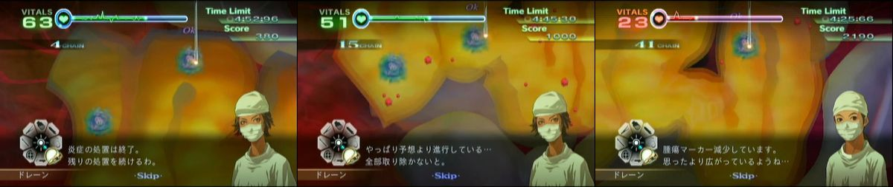

赤い炎症は注射器限界まで消炎剤を吸い上げた場合、大1小2 または 小4 を一気に処理可能。

スクロール真下→右下→少し上→右上と注射をしやすい位置取りを心がける。

> Youtubeで見る 
> 

### 1-6 目覚める奇跡/Awakening

ここでは破裂性の内出血が登場する。切開後は血溜まり等が発生しているが先に処置してしまうと内出血の場所を見失う時もあるので、内出血を最初に切り出してしまうのがおすすめ。

1.  初期内出血位置
2.  初期内出血を全て処理すると新たに4つ追加
3.  追加の4つも処理するとヴァレリーの超執刀が発動して新たに裂傷と内出血が現れる。
4.  内出血は一旦放置し、右上の裂傷を残して他を全て処理する。
5. 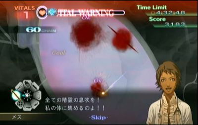 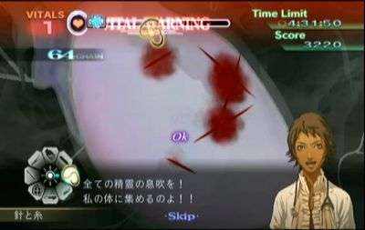 その後、上下の内出血を処理する。その間に残り2個の内出血が破裂するので右上に残した裂傷と合わせて処理する。

> Youtubeで見る 
> 

## Chapter 2

### 2-1 冷たい歓迎/An Icy Welcome

腫瘍位置は画像の通り。
初期配置の腫瘍と炎症は炎症を最後に処理する。処理後即マーカスの超執刀を使って下部の腫瘍から処理する。

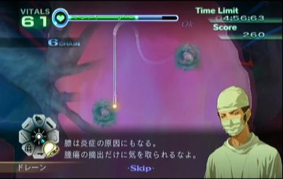 

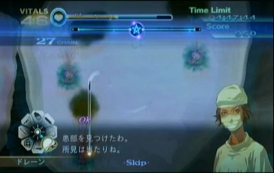 

> Youtubeで見る 
> 

### 2-2 ペースメーカー/The Pacemaker

最初の心臓マッサージ後およそ13秒後に心停止の予兆が発生する。それまでの間にペースメーカーを交換しないといけない。

リード線についてはピンセットで掴める判定がリード線の見た目通りでかなり細いが、最後の接続時のみ画像の矢印の先の部分にごく僅かだがやや広めの掴める判定が存在するのでそこを掴むようにしよう。

接続が完了すると必ず心停止が発生するので交換が間に合わなかった場合は心臓マッサージ回数が増えてしまう。

時間経過での心細動は運が良ければ心停止が発生しないこともある。発生した場合はおよそ10秒程のロス。

> Youtubeで見る 
> 

### 2-3 頼りになる者 (ヴァレリー)/Dependable Pair

骨片を抜くか血溜まりを吸い上げた際に発生する裂傷はバイタル減少がとても大きく設定されているので操作にもたつくようならゼリーを塗っておくこと。

2回目のカウンターショック後、骨が出てくるまでの演出の間に超執刀が使えるので使用する。

> Youtubeで見る 
> 

### 2-4 スティグマ/Stigma

ケイルはレーザーで処理することになるが、一度ダメージを与えるとほんの少しの間ダメージを受け付けなくなるので、レーザーを押しっぱなしにすると無駄に器具の耐久力を浪費してしまうのでほどよく連打するように撃つ。

下の動画は左がレーザー連打、右がレーザー押しっぱなし。ほとんど時間差が無い上に右はレーザーが黄色になるまで消耗していることが分かる。

 

また、レーザーを当てると進行方向とは異なる方向に若干逃れるように移動するので、位置を微調整しながら続けてレーザーを当てて逃さないようにしよう。

最初のケイルを処理すると2体動時に出現する。2体の位置が近いときはレーザーでまとめて薙ぎ払うようにするとレーザーの消耗は増えるが処理速度を上げられる。

> Youtubeで見る 
> 

### 2-5 秘密は炎に燃え/Lost in the Flames

#### 火傷の判定について

画像黄枠の通り火傷1つにつき4つの培養皮膚を乗せる判定が存在する。出血が存在する場合、**出血が発生している火傷の判定全てと隣接した火傷の判定（赤枠）に培養皮膚を乗せられなくなる。**

  

出血は4つの判定のうちいずれかから発生する。出血位置次第では隣接する火傷でも培養皮膚を4枚乗せることができる。下の画像であれば左端から出血しているので黄枠の火傷は全て培養皮膚を乗せることができる。

 

#### 火傷の再出血について

再出血はランダムではあるがおおよそ発生する時間は固定されていて、1回目は残り時間が4分39秒を切った辺りから、2回目は4分16秒を切った辺りから発生する。

全ての火傷が同時に出血するわけではなく、手術開始時にランダムでどの火傷から出血していくかが設定される。

#### 手術手順

理想としては1回目の再出血までに培養皮膚を12枚用意して3つの火傷を治療し、2回目の再出血時間を見ながらもう12枚の培養皮膚を用意していく。

炭化してしまっている火傷については剥がすまでは絶対に出血しないので最後まで放置で構わない。

また、皮膚培養に集中する為にバイタルは常に危険になるので最初の3つの火傷を治療した後にヴァレリーの超執刀を使っておくと以降はバイタル回復無し、または1度だけの回復で済ませられる。

タイム短縮のコツはほぼ培養皮膚のカットにかかっている。いかに縦にまっすぐメスを走らせられるかがタイムを分けるのでひたすら練習するしかない。

> Youtubeで見る 
> 

## Chapter 3

### 3-1 新興難病対策チーム/A Special Assignment

**切開後、およそ3.3秒後に最初の胆石が発生する。**
超執刀の星を描いておいて右上のタイマーで3.2秒後を目安にして超執刀を発動しよう。

> Youtubeで見る 
> 

### 3-2 質疑応答/Q & A

超執刀無しでもバイタルは持続する。特殊な患部等は存在しない。

> Youtubeで見る 
> 

### 3-3 共同研究/Collaborative Research

心筋パッチのガイドは収縮を2回繰り返した後に角度を変えて2回収縮するのを繰り返す。

安定を取るなら角度が変わったあとのガイドを想定してパッチの角度を合わせておく。ミスすると大幅なタイムロスになるので不安ならマーカスの超執刀を使う。

> Youtubeで見る 
> 

### 3-4 忌まわしき痕/Cursed Burden

このステージのソーマはコアの体力が5、ダミーの体力が3となる。コアへレーザーを当ててOKが出ると体力を1減らせる。

コアの体力が2以下になると出現時にダミーと一緒に現れる。見分け方は出現時に一瞬コアが光るほうが本物で光らないほうはダミーとなる。

#### 残り体力3以上の場合

**赤い腫瘍は無視して本体を吸い続ける。**

本体出現後、ドレーンでOKが1回出るまでの間に赤い腫瘍が出現した場合はコア露出演出中のレーザー処理が困難なので赤い腫瘍が悪化する前提でドレーンで吸いつつ、コア露出と同時にコアへレーザーを当てる。1回目のOK判定と同時またはそれ以降ならコア露出演出中のレーザー処理が間に合うので放置しよう。

コアへOK判定を出したら青い腫瘍を全て吸って悪化した赤い腫瘍を処理する。

#### 残り体力2の状態

安定を取るならダミーを吸い上げてから本体を処理するが、**速度重視の場合はダミーを無視する。**
また、この状態ではドレーンで1回目のOKが出るまでの間に赤い腫瘍が発生した場合は放置せずにレーザーで処理すること。

ダミーを放置しているのでコアが露出したあとにダミーも破裂するが、次の本体登場までの間に全ての青腫瘍を処理することで安定を取るよりも2～3秒の短縮が可能となる。

#### 残り体力1の状態

この状態では体力3以上の時同様にOK1回目までに赤い腫瘍が出現したら即処理、それ以降なら放置する。

コア露出演出が始まった時に赤い腫瘍が残っていたらレーザーで処理する。
そして超執刀の星を描いてコア露出と同時に超執刀を発動する。この時にダミーも破裂演出に入っているはずだが**本体をDefeatするとダミーが消滅する**ので青い腫瘍をドレーンで吸って手術終了となる。

> Youtubeで見る 
> 

### 3-5 DHS副総監 （ヴァレリー）/The Deputy Secretary

最初の動脈瘤は道具を注射器に合わせていると鎮静剤の瓶が現れないので注射器以外の道具を選択しておくこと。

後は動脈瘤が出現次第処理していくだけとなる。動脈瘤が出現したばかりであれば満タンまで充填した鎮静剤で2個まで切除可能にすることができる。

4個同時出現の動脈瘤はヴァレリーの超執刀を利用し、左下を残して破裂させることで鎮静剤投与の手間を省こう。

動脈瘤の縫合する方向については血管自体を裂傷に見立てて縫合しよう。

> Youtubeで見る 
> 

## Chapter 4

### 4-1 医療格差/Money Talks

**即テキストスキップ**

2人目はマーカスの超執刀を使って膿が増殖しないようにする。膿が残っていると注射等の判定が消失するのでちゃんと吸うこと。

> Youtubeで見る 
> 

### 4-2 憂鬱なドライブ （ヴァレリー）/Good Samaritans

内出血もありバイタル減少が激しいのでヴァレリーの超執刀を使って処理する。

内出血位置は画像の通り。中央部分の内出血は処理が進むと出現する。上部には大裂傷のすぐそばに内出血がある上に通常の出血も重なっている状態なので縫合を邪魔されないように手早く処理すること。

内出血は大裂傷から出血していても切り出しは可能なのでまず内出血から処理してまとめてドレーンで吸い上げよう。

  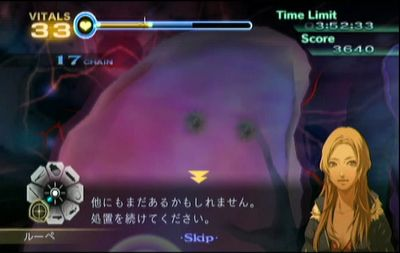

> Youtubeで見る 
> 

### 4-3 出演命令 （ヴァレリー）/Forced Appearance

初期腫瘍位置。この3つと炎症を完全に処理した後にルーペで移動すると次の腫瘍が出現する。

初期位置右上に腫瘍が3個現れる。出血箇所を頼りに3個摘出（人口膜不要）するとさらに5個の腫瘍が現れる。

さらに追加の腫瘍5個位置。この状態でどの腫瘍でもいいのでメスで切り出してドレーンを使用した次点でドレーンが故障するイベントが発生する。

しばらくドレーンが使えなくなるのでまずはバイタルの回復に務める。バイタル注射が使えなくなったら4箇所の腫瘍を切り出してバイタル回復に戻る。

ドレーンが使えるようになると司会のナレーションが入るが、実際はナレーションの直前にもドレーンが使用可能になるのである程度回復したらスティックを右下に入れておいてすぐドレーンに切り替わるようにしておく。

ドレーン復活後に心細動から心停止が発生するので可能な限り出血の吸い出しと腫瘍の切除を進めておく。心臓マッサージが終わったらヴァレリーの超執刀を使って残りの腫瘍を摘出していく。

時短の為にはドレーン復活後から心停止までに可能な限り摘出を進めたいが、その間バイタルを相当減らされてしまうので心細動中にバイタルが0にならないように注意する。ドレーン復活次点でバイタルが40未満の場合は危険なので回復したほうが良い。

 

> Youtubeで見る 
> 

### 4-4 対決 （ヴァレリー）/Showdown

大動脈瘤は出現直後であれば鎮静剤満タン1回で切除可能になるので出現位置を覚えて準備しておく。

最初の大動脈瘤処置後は画面左に現れる2個を処置する。その後画面左端までスクロールして小さい動脈瘤を処置する。

これで画面外に大動脈瘤2個と小動脈瘤1個、画面内に小動脈瘤が1個出現するのでヴァレリーの超執刀を使って画面内の小動脈瘤から処置する。

一番右に出現した大動脈瘤2個はもっとも破裂するのが遅いが、必要な鎮静剤の量もかなり多いので自然に破裂するのを待ってもタイム差はほぼ発生しない。下の動画のように一番右以外を処理しつつ破裂を待ってから大動脈瘤2個を処理しよう。

大動脈瘤の縫合方向については画像の通りにする。

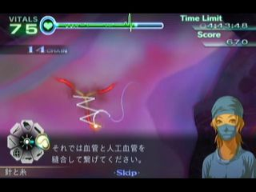 

> Youtubeで見る 
> 

### 4-5 スタジオ急変 （ヴァレリー）/Studio Emergency

オープスにレーザーで4回OKを出すと2体に分裂するので分裂中に超執刀を使用して、以降は被弾を無視してひたすらレーザーを使う。

オープスはOK判定が出た後は僅かな時間レーザーが効かないので無駄撃ちに注意する。分裂後は片方にOK判定を出したらもう片方にレーザーを当てるように、交互にOK判定を出すようにしよう。

> Youtubeで見る 
> 

## Chapter 5

### 5-1 フェイス・オフ/Face-Off

この手術では一定時間ごとに痙攣が発生して手術道具が使用できなくなるが、**痙攣発生までの時間はマーカスの超執刀を使うことで引き伸ばすことができる。**

切開後にすぐ超執刀を使って最初の痙攣が発生する前に全て処理してしまおう。突き刺さっているスティックがかなり長いことと、靭帯を縫合する際の向きに注意しよう。

> Youtubeで見る 
> 

### 5-2 不幸は身近に/Misfortune Strikes

**心細動の発生条件はカウンターショック成功後約9秒経過**で、この時間はマーカスの超執刀で引き伸ばすことはできない。

裂傷を含む全ての傷を処置した上でマーカー部分へ人口膜を乗せ終えた時点で心細動が発生しなくなる。中央の破裂部分からは再出血しないので処理手順は自由。心細動発動前に終わらせよう。

> Youtubeで見る 
> 

### 5-3 暗転/Fade to Black

**心細動の発生条件はマーカー部分の出血を1度でも吸ったら**なので、手を出さない限りは心細動は発生しない。

右上及び左下の内出血は初期の出血状態でも切り出すことができるので、まずは内出血を切り出してから出血をまとめて吸い上げて縫合していく。

最後に中央部分はドレーンで吸引しても出血するが、やがて出血が収まるので人口膜を一気に載せてゼリーで定着させよう。内出血を処理していない状態だと出血が収まらないので注意すること。

> Youtubeで見る 
> 

### 5-4 隷従/Coercion (HARD MODE)

**ここで難易度をHARDに変更することでオニュクスの潜伏時間を短縮することができる。**

オニュクスの初期位置は画像参照。

* 緑丸：初期画面位置で補足可能
* 黄丸：画面外だがエコーで特定可能
* 赤丸：初期画面位置ではエコー不可。要スクロール。

このステージのみ、エコー範囲内にオニュクスが居た場合、エコーで確定しなくてもBGMが切り替わるのでそちらにも注意を向けよう。また、潜伏場所の1箇所が道具アイコンと重なっているので注意すること。

一度血清を投与した後にオニュクスが潜伏するのは潜伏時に頭が向いている方向となる。頭の向きはそこまで正確ではないが、ダミーと一緒に移動する4つ目に関してはほぼ正確に次の潜伏位置へ移動する。
なお、移動したと思ったら実は潜伏動作前の足元位置だったということもあるのでエコーは徹底しよう。

> Youtubeで見る 
> 

### 5-5 ディア・ハント/No Escape (HARD MODE)

左上と右下に散弾が埋まってるので取り除く。右下の散弾を取り除くには隣接した出血も吸い上げる必要がある。

再出血までの時間はとても短いので先に右下2箇所を治療してしまうか、操作ミスをしない自身があるならそのまま全ての出血を吸い上げて一気に人口膜を被せて治療してしまうこともできる。

切開後の内部では左上と左下が散弾摘出前にさらなる切開が必要。

> Youtubeで見る 
> 

### 5-6 感染変異/Mutation (HARD MODE)

**即テキストスキップ**

5-4とほぼ一緒。初期位置は画像参照。

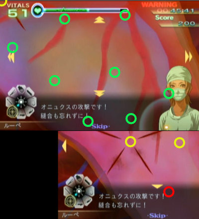

**クリア後はテキストスキップのみ行う。そして難易度をNORMALに戻すこと。**

> Youtubeで見る 
> 

### 5-7 処刑ゲーム/Endgame

[通常攻略参照](https://szsk.github.io/data/tcnb/ch5.html#e57)

> Youtubeで見る 
> 

## Chapter 6

### 6-1 緊急会議/An Urgent Meeting

ブラキオンは先端組織が生える際に**生えきらない間から血清の投与が可能**。これをやるだけでもかなり楽になるので先端組織の場所をある程度覚えておこう。

1セット目と2セット目は速度が十分に早ければ節を潰すこと無く摘出可能。

> Youtubeで見る 
> 

### 6-2 赤道クルルマ/Culuruma

開胸前からマーカスの超執刀を使ってしまうと中央の赤腫瘍の色変化がかなり遅くなるので超執刀は開胸後に使用すること。

左上、右下、右上、左下、中下、中上の順に色が変わる。**赤から青に点滅し始めている状態はドレーンを使っても問題ない。逆はNG**。

> Youtubeで見る 
> 

### 6-3 病める村 （ヴァレリー）/An Ailing Village

ソーマ、ブラキオン、オープスの順。対処法は通常通り。ヴァレリーの超執刀は最後のオープスで使用する。

> Youtubeで見る 
> 

### 6-4 クルルマ・メタル （ヴァレリー）/Culurium

手術開始後10秒程で心細動が発生するので右側の銃創3箇所の処置と中央の銃創4箇所の散弾摘出までは終わらせたい。中央の銃創について、血溜まりが隣接している場所があるのでドレーンで2箇所ずつ吸い上げよう。

心停止した場合は蘇生後にバイタルが回復する。20程度残っていて残りが内出血だけなら超執刀と回復不要で処置を続ける。

心停止が発生しなかった場合は内出血切り出し用のバイタルが足りないはずなのでヴァレリーの超執刀を使用して残りの処置を行う。

内出血の場所は画像の通り。

 
 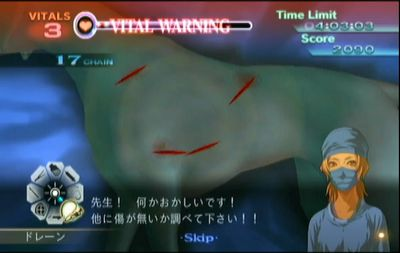

> Youtubeで見る 
> 

### 6-5 戦火 （ヴァレリー）/The Heat of Battle

#### 一人目

カウンターショックでの蘇生から始まる。

火傷の治療は2-5と同様だがA・B・Eの火傷は蘇生後から30秒ほど経過すると炭化してしまうので、まずはこの3つを最優先で治療しなければならない。

 

注意点の1つ目、**Cの火傷からの出血は吸い上げてはいけない**。この出血を吸い上げてしまうとBの火傷に培養皮膚を乗せようとしてCに乗ってしまう事故が発生する。出血が残っていればCの火傷の判定がなくなるのでBの火傷へ培養皮膚を確実に乗せることができる。

注意点の2つ目、Dの火傷は右上・右下・左下の枠のいずれかから出血していたら吸い上げなければEの火傷へ培養皮膚を乗せることができない。↓画像の通りにDの火傷の左上から出血した場合だけ吸い上げること無くEの火傷へ培養皮膚を乗せることができる。

注意点の3つ目、Eの火傷へ培養皮膚を乗せる際にDの火傷に吸われてしまうことがある。培養皮膚を乗せる際はEの火傷のやや右側を目安に乗せるようにしよう。

2-5同様に火傷を3つ治療し終えたらヴァレリーの超執刀を使用する。超執刀中に培養皮膚の切除と炭化した火傷の切除まで行っておこう。操作ミスが無ければバイタル回復無しで治療を終えられる。

#### 二人目

切開前は左端の隣接した2箇所に散弾が埋まっているのでまずはこの2つを摘出する。

出血については画像のA・B・C・Dの4箇所で2つの出血を同時に吸い上げることができる。Cのみ離れていて少々シビアなので無理だったら片方ずつ吸い上げよう。操作ミスが無ければ再出血するまでに人口膜を乗せてゼリーを塗ることができる。

内部の散弾位置は画像の通り。

#### 三人目

切開前または切開後のガラス片処置直前にバイタルを60程度まで回復しておこう。

内部の処置を進めていくと画像の通りに内出血が出現する。この内出血は時間経過で破裂しないが切り出さないで放置しておくのが最もバイタル減少が激しいので内部下部のガラス片等の処理が終わり次第すぐに切り出そう。

  

#### 四人目

骨片を抜く度に裂傷と血溜まりが発生する。ミスさえ出さなければバイタル減少はそこまで酷く無いので骨片を全て抜いてから血溜まり下の小出血と小裂傷を全て処置するように広めにゼリーを塗りまくろう。

血溜まりで骨片を抜く方向を見失いやすいので注意すること。

#### 五人目

初期内出血は5箇所で、さらに1箇所でも縫合すると追加で裂傷と内出血3個が現れる。**初期内出血を全て切り出しただけの状態**であれば安全なので、バイタルを回復する余裕がある。

また、内出血の追加だけでなく右上部での裂傷と小出血も発生するがこちらは内出血無し。処置手順としては初期内出血を全て切り出した後に回復し、左上の既に切り出した内出血の縫合を行う。その後追加の内出血も切り出しておき、少しずつ出血の吸い出しと縫合を行って再出血を防ぎながら安全に処理していこう。

右上に追加で発生した小出血は放置すると内出血同様にバイタルを大きく減らしてしまうが、数十秒放置しない限りは安全なので後回しでも問題ない。不安なら回復ついでにゼリーで処理しておこう。

  

> Youtubeで見る 
> 

### 6-6 血塗られた取引/Signed in Blood

#### 一人目

画面が初期位置のままだとケイルが画面外に移動することが多いのでまずはやや右下へスクロールしよう。
合体待機中に門脈(黄)を繋いでしまう。必要な収縮剤は注射器1.1本ほど。

マザーケイルは2回目にOKを出したら動脈へ収縮剤を満タン1本投与する。3回目のOKで切除可能にして倒したらそのまま繋いでしまう。

#### 二人目

マザーケイルとオニュクスを同時に相手にしてしまうと潜伏位置次第ではマザーを抑えるのに精一杯でオニュクスに血清を投与できない。

そこで基本的にはケイルをやや放置しつつオニュクスの処理を進める形になる。目安としてはケイル2体同時出現後は残り1体をギリギリまでダメージを与えてから放置してオニュクスを進める。オニュクスへ5回目(ダミー+巣の状態)のOKを出した辺りでケイルに止めを刺して合体中にオニュクスを倒してしまいたい。

マーカスの超執刀は2体同時に出現したあたりで使用する。

> Youtubeで見る 
> 

## Chapter 7

### 7-1 グランマ （ヴァレリー）/The Rose's Thorns

3個同時のシーンではヴァレリーの超執刀を利用してバイタル回復の手間を省く。

3個のうち1つでもドレーンで吸い上げると停電になる。左端の腫瘍を吸い上げて停電になってもそのままメスで血管の切除まで行い、ライターを右の2個にのみ使うようにすれば多少の時間短縮となる。

青い小腫瘍を見逃しやすいので注意する。腫瘍1つにつき最大4個まで周囲に発生するので腫瘍摘出後は念入りにライターを動かしてチェックしよう。

 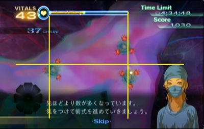

> Youtubeで見る 
> 

### 7-2 掃討作戦/Strike Force

#### 1人目：ブラキオン

通常通り。節の数が変化したりしているが基本的な対処法は変わらない。

#### 2人目：ケイルとソーマ

マーカスの超執刀を利用してケイルを優先的に倒す。ケイル2体同時に薙ぎ払うようにレーザーを当てることで早く倒すことができるがレーザーの消耗が激しいので耐久力に注意しながら残りのケイルとマザーを倒す。

ソーマはコアの耐久力が3でダミーの体力が4となる。ダミー無視を1度だけ行う。

#### 3人目：ソーマとオニュクス

**オニュクスの初期位置は画面中央に固定されている。**

まずはオニュクスを最優先で処理する。潜伏場所を追いかけて時間をかけずに血清を投与していこう。
潜伏待ち時間の間はソーマにドレーンをかけてコア露出直前の状態で止めておく。

オニュクスへ最後の血清投与時はソーマへドレーンをかけて、コア露出の待ち時間の間にメスで切り出し、ソーマへレーザー+腫瘍へのドレーンが済んだら血清を投与してトドメを刺そう。

ここのソーマもコアの耐久力が3でダミーの体力が4なので一度だけダミー無視を行う。

> Youtubeで見る 
> 

### 7-3 教授、あなたの名前を/Identity Loss

最初から超執刀を使用してピン抜き時の待機時間を無くす。
ピン抜きは左右への判定が狭いので真っ直ぐ上に抜く練習が必須。

> Youtubeで見る 
> 

### 7-4 カフカスの兵器庫/Weapon Depot

白注射に関しては患部内のどこに注射しても問題ない。

普通にプレイすると最後の炎症セットの時に注射器が破損してしまうので耐久力に注意しつつ少し回復待ちを入れる必要がある。

そこで時短の為に途中でわざと注射器を破損させる。

1. 黄
2. 黄2
3. メッセージ待機
4. 黄2・赤1
5. 黄1・青2
6. メッセージ待機
7. 赤2・青3
8. メッセージ待機
9. 赤3・黄1・青1
10. 赤2・黄1・青2

7番の赤2青3が終わった後に注射器を破損させたいので5番を処理した後に回復薬を少量（黄色炎症に必要な量程度）打つ。そうすると7番の処理が終わった後にメッセージ待機中に回復薬を少量打つことで注射器が破損する。

あとは9番と10番を注射器耐久力を気にせず処理することができる。これでおよそ1秒程の短縮が可能。

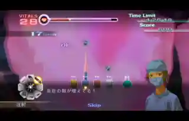

> Youtubeで見る 
> 

### 7-5 古城の女/Lady of the Castle

切開後すぐにマーカスの超執刀を使用する。
心細動中でもメスは利用可能なのでバイタルの続く限りチップの切除を続ける。

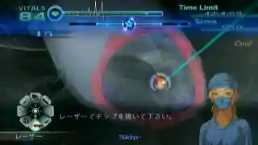

> Youtubeで見る 
> 

### 7-6 マスター・ヴァフシュティ/Master Vakhusti

**即テキストスキップ**

剥がせる状態の膜にカルディアが乗った場合、カルディアが膜の中央付近に位置している時に限ってピンセットで掴むとカルディアをワープさせられるので、基本的にはカルディアを気にせずタイルにゼリーを塗って一気に剥がしていくことになる。

#### 1セット目

全タイルへゼリーを塗ってカルディアをどけて一気に剥がす。

#### 2セット目

カルディアは画面中央へ出現するので中央含む半分以上のタイルにゼリーを塗って出現前に剥がしてしまう。

タイルについても出現前にゼリーを塗っておけば出現後にゼリーが浸透するので、このステージでは**エコーによる画面スクロールを行ってはいけない。**

#### 3セット目

2セット目より上下に広く塗りづらいがここでもスクロールせずにまずは下半分でゼリーを塗って剥がす。

#### 第二形態

BGMが変化してカルディア第二形態との戦いになるが、まず道具がリセットされているのでレーザーへセットし直す。そしてカルディアは動き出すまでのほんの少しの間レーザーによるダメージを受け付けないので注意しよう。

ある程度ダメージを与えたらマーカスの超執刀を使って一気に倒すが、ダメージの目安としては1回目のOKが出てから数秒レーザーを当てたぐらいが最も安定する。

腫瘍設置→波動を出している間にレーザー照射でOKを出して、そのまま当て続けてレーザーの耐久力が0になるぐらいだとちょうど良い。最初の移動シーンで無駄打ちしてしまうとダメージが足りないので無駄打ちを避けるためにもレーザーは押しっぱなしではなく、カルディアがカーブしそうなあたりで打つのを止めたりしよう。

レーザーが壊れたら超執刀の星を描いて、耐久力回復を見計らって超執刀を発動し、後は一気に倒してしまおう。最後の発狂中、波動を出す前には倒せるはず。

> Youtubeで見る 
> 

### エピローグ

**即テキストスキップ**

夜景のシーンで暗転してSkipの表示が消えたらタイマーストップ。

## その他

### 別カテゴリについて

Any%の他にはAll XSというカテゴリが存在する。難易度ハードでのみ各ステージで指定条件をクリアして規定のスコアを稼ぐとXSの評価が得られ、全ステージでこの評価の取得を目指すプレイとなる。

XS取得にはノーミスだけでなくチェインを切らさないことや余分にスコアを稼ぐ必要があるステージも存在する。

また、各ステージについてマーカスかヴァレリーのどちらかでクリアすれば良いが、Any%ではプレイ不要なスコアアタックやクリア後のステージについてもクリアしなくてはならず、最も過酷なカテゴリとなっている。

### RTAイベントでのカドゥケウス

- [カドゥケウス NEW BLOOD - RTA in Japan Winter 2022](https://www.twitch.tv/videos/1692630771)
- [AGDQ2020 カドゥケウス NEW BLOOD All XS(Japanese Restream)](https://www.twitch.tv/japanese_restream/video/534727431)
- [AGDQ2019 救急救命 カドゥケウス2(Japanese Restream)](https://www.twitch.tv/videos/361295431)
- [Trauma Center: New Blood by SlurpeeNinja and Iris Joker in 1:34:44 - AGDQ 2017](https://www.youtube.com/watch?v=8g_7Hx42P1Y)
- [Trauma Center Second Opinion by Irisjoker in 1:30:56 - SGDQ 2016](https://www.youtube.com/watch?v=n9a2wlLZNVE)
- [Trauma Center: Under the Knife 2 by TrjnRabbit in 2:07:30](https://www.youtube.com/watch?v=5b2_x3vJbYA)

