# カドゥケウスZ 2つの超執刀 Any% Normal RTAガイド

- [RTA前の準備](../preparation.md)
- [Wiiリモコンの操作方法](../wiimote.md)
- [基礎知識](../basic.md)
- [Chapter1](#ch1)
- [Chapter2](#ch2)
- [Chapter3](#ch3)
- [Chapter4](#ch4)
- [Chapter5](#ch5)
- [ChapterZ](#chz)
- [Chapter6](#ch6)
- [ギルス攻略](guilt.md)

## RTAの前に

- オートセーブのON/OFFが可能なので、ニューゲーム前にタイトル画面でOFFに設定してください。
- 「この物語はフィクションです―――」の註釈が消えたらタイマースタートですが、Wiiからゲームを起動させた直後にNEWGAMEで始めると、註釈の後にNOW LOADINGが表示されてしまうことがあります。起動直後は1度だけ適当なデータをロードしてからタイトルへ戻りましょう。
- チャプターZは開放されるたびにクリアするよりも、チャプター5を終わらせてから開始したほうが、ほんの少しだけ早くなります。
- チャプター5からチャプター1へ移動する場合は、左端のサイドバーにポインタを乗せて、十字キーの上を押しっぱなしにしてください。

## 各種テクニック（手術）

### ゼリーはピンポイントに置く

Zではニューブラッドと違って、ゼリーを塗った際の周囲への浸透が遅く、切開時や人工膜、腫瘍痕などにゼリーを塗っても微妙にずれていた場合に即座にOK判定にならないようになっています。

いち早く浸透させるためには、ゼリーを判定ポイントへ正確に**置く**必要があります。密集している場合は、ゼリーを普通に塗っても大丈夫ですが、散らばっている場合は**塗らずにピンポイントに置く**ようにしましょう。

  
▲適当に塗ったせいで下の人工膜の定着に時間がかかってしまっている

### エピソードセレクトスキップ（ESS）

カドゥケウスZには手術のないエピソードがいくつか存在します。それらのエピソードではマップ画面の暗転後からエピソードタイトルが表示されるまでの間にESSを利用できます。


また、下記エピソードはマップ画面なしですぐにエピソードタイトルが表示されるため、開始後すぐに(+)ボタンを連打してESSを利用してください。

- 2-2 超執刀
- 3-1 入局の日
- 5-1 恐怖の予告状
- 6-1 招待状


----

### 切開

カドゥケウスZはゼリーの浸透が遅いため、浸透を待っていると切開に時間がかかってしまいます。

そこで下記の切開方法を利用していきます。

#### 半消毒切開

一度だけ一直線にゼリーを塗りますが、浸透を待たずにそのままメスで切ります。

ゼリーが浸透したガイドポイントはミス判定がかなり緩くなるので、浸透しなかったポイントにのみ注意して切開することになります。慣れればミス率はかなり低く済むのが特徴です。

所要時間は約1秒です。


#### 全消毒切開

切開ライン全てにゼリーが浸透するのを確認してからメスで切ります。つまり普通の切開です。

一部ステージにおいて切開ミスでどうしてもバイタルを減らしたくない場合や、そもそも切開ラインが湾曲していて切りづらいような場合に使用します。

所要時間は約1.5秒です。

#### 無消毒切開

ゼリーなしで切開します。ガイドラインから少し逸れただけでミスになってしまいます。成功すれば0.4～0.6秒で切開できるので最速ですが、ミスした場合は1秒程のロスとなります。

1-5のポリープ手術など、一部手術は切開のガイドラインが短めなので消毒なしでタイムを稼ぐチャンスです。


!!! info
    何度か試しましたが十分な成功率を得られないと判断したので、著者はこのテクニックを**使用していません**


## Chapter1 {#ch1}

!!! info
    各ステージ名末尾の ◆ は、手術終了後にエピソードセレクトスキップを**行わずに**そのままテキストを早送りすることを意味します

### プロローグ

プロローグテキストが表示されても**ESSを使用せずに**テキストをスキップします。

エピソードセレクト画面に移ってチュートリアルテキストが表示されたら、これも(-)ボタンでスキップして1-1を開始しましょう。

### 1-1 執刀の心得 ◆

裂傷を1つ縫合すると**トーク待ち**のために操作が中断されてしまいますので注意しましょう。

トーク待ちはゲーム全体を通して度々発生します。縫合の糸の操作や注射の最中などでも操作がキャンセルされてしまいます。トーク待ちを忘れているとプレイのテンポが崩されてしまうので、念頭においてプレイしましょう。

このステージだけテーピングの前に消毒が必要になります。次のステージ以降は消毒しなくても良いので即テーピングを行いましょう。

!!! tips "ヒールゼリーが途切れる"
    閉創時のヒールゼリーはAボタンを押しっぱなしにした状態で端から端まで数往復すればOKですが、まれに押しっぱなしにしているのにヒールゼリーが途切れることがあります。塗る際の効果音が切れたと思ったらAボタンを押し直しましょう。

### 1-2 続・執刀の心得 ◆

最初のバイタル注射は満タンまで充填（じゅうてん）してから打たないとやり直しになるので注意してください。

腫瘍もエコー1回で確定させないと会話が入ってしまって遅延してしまいます。腫瘍の位置は完全に固定されているので覚えてしまいましょう。


腫瘍摘出後は人工膜を乗せて膜の中心にヒールゼリーを置きましょう。連打でも可です。適当に塗るとOK判定が出るまで時間がかかってしまうので、丁寧に処理してください。


### 1-3 別れの手術 ◆

炎症はどちらも小サイズなので注射器1/4程度で2つとも処置することができます。

腫瘍の位置は毎回固定で、上部の2つはメスを一直線に走らせて一度に切り出すチャンスです。成功すれば1～2秒のタイム短縮が見込めます。

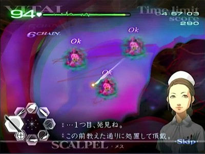


### 1-5 哀愁の歌うたい

<!--
切開のラインが短い直線なので、無消毒で切開するチャンスです。


-->

ポリープの出現位置と個数は毎回固定です。タイム短縮のコツは

1. レーザーで複数のポリープを一度に焼く位置取りを素早く行うこと
2. 焼却時間を体で覚えて、レーザーをムダ打ちしないようにすること

初期配置のポリープは画像の順番のとおりにレーザーで焼却しましょう。そうすると血だまりが発生しても、左下のポリープは血だまりの影響を受けずにレーザーで焼くことができるので、ムダな器具切替えが発生しなくなります。


以降はポリープ群を処理する度に下記画像のとおりに次々とポリープ群が出現します。ルーペで事前にズームした後にドレーンで待機しておいて、血溜まりを吸い上げたらレーザーで焼却しましょう。

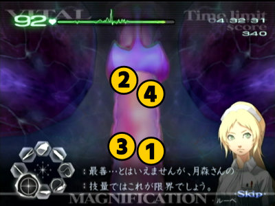


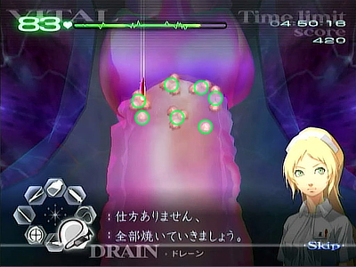


### 1-6 医師の資格

このステージではバイタルの減少が激しいので、処理に手間取りやすい場合は切開する前にバイタルを全回復させておきます。

[人工膜の定着遅延を回避する](../basic.md#jerry_delay)ためにも、まずは4つの腫瘍を摘出します。腫瘍は矢印のとおりにメスを動かして露出させます。

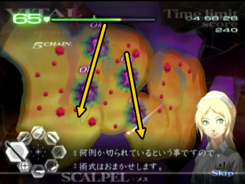

炎症は注射器一杯に消炎剤を充填した場合、大2個または大1個小2個を除去することができます。

実際には9割程度の充填でも大丈夫ですがミス打ちした際に充填した薬剤がほんの少し減少してしまう仕様があるので、不安なら毎回フル充填しましょう。


すべての患部を処置したらエコーに切り替えてひたすらエコーを連打することで閉創に移行します。

-----

### 1-8 生か、死か

<!--
開胸ラインはかなり短いので、こちらも無消毒チャレンジのチャンスです。
-->

開幕カウンターショックが必要になります。切開後は心臓に刺さったガラス片をすべて抜いてからゼリーを塗ります。ガラス片の数が多いのでスムーズに抜けるようにするにはかなりの練習が必要になります。

ゼリーの有効判定が広いのか、ピンポイントに置かなくてもOKになりやすいように感じます。もちろん、ピンポイントに置いても良いです。


再びカウンターショックの後に大型のガラス片が登場し、さらに超執刀イベントも発生してから手術終了です。

!!! warning "処理落ち"
    大型のガラス片が登場する際に左スティックで器具を選択してしまっているとなぜか処理落ちが発生してしまうことがあります。ガラス片が登場しきるまでは左スティックに触らないようにしましょう。

    

-----

## Chapter2 {#ch2}

### 2-1 眠れる力

血栓を処置する時はエコー・ピンセット・メス・ドレーン・ゼリーを次々と切り替えるため、見た目に反してかなり忙しく、そして操作が難しいです。

特にドレーンはちゃんと判定が表示されるまで吸い切ることを意識しないと、血栓を吸引しきれていなくてエコーからやり直しとなってしまうこともあります。

血栓は出現順が完全に固定です。下記画像の1～3の血栓を順番どおりに処理をして、最後の4と5は合流しそうな頃にピンセットで固定して、まとめてドレーンで一気に吸い上げます。


追加の血栓が現れたらエコーで確定だけしておいて、全ての血管が合流する地点でピンセットで止めて一箇所に集めておきます。

そしてイベントで超執刀が発動後したら集めておいた血栓を一気に処理してから、追加で現れた左上と下の血栓をそれぞれ処理すれば手術完了です。


-----


### 2-3 神の手を目指して ◆

超執刀を5回発動すれば終了する簡単なステージ…と言いたいところですが、超執刀発動毎に**トーク待ち**が発生してボタン入力がそのたびにキャンセルされます。

Zボタンを押しっぱなしにしておいて星マークが見えたのを確認してから超執刀を発動するようにしましょう。

-----


### 2-4 神の手の覚醒

動脈瘤（どうみゃくりゅう）は出現位置が毎回固定です。ルーペによる術野移動を行う場合は毎回同じ場所でルーペを使用して、可能であれば動脈瘤が画面右寄りになるように位置取りをすると操作しやすくなります。

  
▲ルーペ使用位置例

#### ルーペ1回目

最初から見えている動脈瘤を手順とおりに処理します。血管同士の吻合（ふんごう）については裂傷に見立てていつもどおりジグザグに縫うだけでOKです。

動脈瘤を処理したあとに**ルーペでズームアウトすることで次の患部が発生します**。

#### ルーペ2回目

1度ルーペでズームアウトすると約4秒後に次の動脈瘤が中央やや左上に出現するので前述した画像の2番の位置にポインターを合わせてズームインします。

ルーペでズームインしたら出現まで待機します。待機中に鎮静液を用意しても**トーク待ち**で注射が解除されてしまうので特に何かする必要はありません。

#### ルーペ3回目（最初の2個）

ルーペ2回目の動脈瘤を処理が完了した約3秒後に術野右側に動脈瘤が2個出現します。**トーク待ち**は発生しないので鎮静液を充填しておいて出現場所へポインターを合わせておきます。


#### ルーペ3回目（追加の2個）

動脈瘤を2個処理すると間を置かずに追加で2個の動脈瘤が術野左上に出現します。出現位置はかなり遠いので、ルーペで移動して処理しやすい位置まで移動したほうが操作はしやすいです。

一応画面内に収めたままでも鎮静液1回で2個とも切除まで持っていくことが可能です。

下の動脈瘤の肥大化が上のものより若干早いので、鎮静液を**下 → 上**の順番で投与すると1回の充填（じゅうてん）でどちらも切除可能にすることができますがかなりの操作精度を要求されます。


#### 4個同時

追加の2個も処理すると、時間を置いてから最後の動脈瘤が4個同時に出現します。

4個のうち左右の2個が早めに破裂する個体となっています。あえて破裂させることで鎮静液の投与をしなくて済むので、先に上下の2個を処理したら残りの2個は破裂するまで待機しましょう。


-----


### 2-6 生きたくない。 ◆

裂傷と大裂傷のみで終了する短いステージです。

初めて大裂傷にドレーンを使用した後と2つ目の大裂傷の処置が完了する時のそれぞれに**トーク待ち**が入って操作が中断されるので注意しましょう。

-----


### 2-9 生きたい。

:warning: バイタル注意

基本的な攻略は[ギルス攻略：キリアキ](./guilt.md#g1)を参照してください。

キリアキ初登場です。以降にキリアキが出現するステージとは異なって、ここでは**トーク待ち**が頻繁に発生してしまいます。バイタルを回復する暇がほとんどない上に、**トーク待ち中にキリアキが潜伏したまま動いてしまう**のでエコーによる特定が難しくなっています。

#### キリアキ1体目

キリアキ出現と同時に**トーク待ち**が発生します。本来1体のみ出現する時は裂傷の先端にエコーを当てることですぐに特定できますが、ここではトーク待ち中に移動してしまうのでその方法は使えません。

裂傷は放置して、まずは裂傷の約2倍の長さの延長上（斜め方向に出現した場合はほぼ画面中央に戻っています）を意識してエコーで探します。


1体目の処理が完了すると再びトーク待ちが発生します。そして数秒後に2体目が出現するので僅かな猶予時間の間にバイタルを回復しましょう。回復薬フル充填で1度ともう少しは回復できます。

#### キリアキ2・3体目

2体目が出現した1秒ほど後にトーク待ちが発生します。難しいですが、トーク待ち発生までの間にエコーによる特定だけでも済ませておきたいです。

さらに時間経過で3体目も出現します。3体目は**出現時の移動と裂傷生成方向が真上で完全に固定**なので、術野の上部にエコーを打つことで確実に特定することができます。


#### マザー

耐久力は3と少ないですが、ここまでほとんど回復できないはずなので、出現後にバイタルが20以上残っていない場合は回復しましょう。

#### 閉創

閉創に移行すると長い**トーク待ち**が発生します。さらに、このトーク待ちはトークが終わっても**器具を使用できるようになるまで0.37秒ほど操作不可状態が続いてしまいます**。

いつもの調子で縫合しようとするとミス発生からのゲームオーバーになる可能性が高いので、ふだんより多めに縫合するようにして備えましょう。

  
▲ポインタのジグザグ移動の最初の数カ所が縫合として認識されていない


▲トーク待ち中にスティックの右とAボタンを押しっぱなしにしている状態。器具が使用可能（左下のツールアイコンが表示される）になっても実際に縫合が開始されるまでに0.35秒かかってしまっている。

-----


### 2-11 君のため、皆のため

心臓の切開時に**器具をメスに変更すると**心停止が発生します。

<!--
この時に時間経過によるゼリーの浸透を狙ってゼリーを塗った直後にメスに変更するとムダがありません。
-->

切開後は6秒ほどで再度心停止が発生してしまいます。この心停止は超執刀で発生までの時間を延長できるので、操作が間に合わなかったり安定しないようなら超執刀を使いましょう。

!!! warning "先行入力破棄"
    このステージ限定で、心臓の切開が完了してから画面の切り替わりが終わったあとにボタンの先行入力が一旦解除されてしまうので注意しましょう。

    通常は画面切り替わり中にスティックをドレーンに入れてAボタンを押しっぱなしにしておくと、操作可能になると同時にドレーンを使用できますが、ここでは先行入力が全て破棄されてしまうせいでドレーンが動きません。
    
    器具が使用可能になったのを確認してから、しっかりAボタンを**押し直す**ことが必要になります。

#### 弁の切除

3段階の切除が必要です。弁の外周をなぞるようにぐるぐるメスを回しましょう。

#### 弁の交換

トレイに乗っている弁の右側の赤い枠部分には**ピンセットのつかみ判定がありません**。制限時間が迫る中でつかめないと焦ってしまって余計につかめないので真ん中を確実につかみましょう。

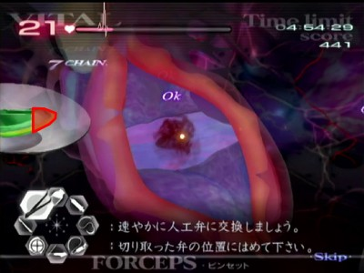

#### 弁と心房の縫合

弁は左から右へ、心房は上から下へ縫合しましょう。縫合の幅は動画と同じくらいで問題ありません。


-----


## Chapter3 {#ch3}

### 3-2 ギルス ◆

基本的な攻略は[ギルス攻略：キリアキ](./guilt.md#g1) を参照してください。

術野が広いせいでキリアキが隅のほうまで移動する場合があります。縫合も大事ですがバイタルに余裕があるステージなのでキリアキの潜伏場所特定を優先しましょう。

#### 初期患部

裂傷と大裂傷が配置されています。全て治療した後に最初のキリアキが出現するまで2秒ほど猶予があるので回復薬フル充填で1～1.5回ほど回復しましょう。

#### キリアキ1体目

1体のみの出現なので裂傷の先端を意識してエコーを当てることですぐに特定が可能です。

#### キリアキ2体目・3体目

右側のキリアキは**裂傷生成方向が真上で完全に固定**なので、術野の上部にエコーを打つことで確実に特定できます。まずはこの右側のキリアキを特定してからもう一体のキリアキを特定しましょう。


#### マザーキリアキ～閉創

マザーキリアキを倒したあとに閉創に移ると、再び長い**トーク待ち**が発生します。操作可能になったのを確認してからしっかり縫合しましょう。

-----


### 3-4 かけがえのない物

基本的な攻略は[ギルス攻略：デフテラ](./guilt.md#g2) を参照してください。

最初は1対、次は2対のデフテラの処理となります。バイタルは継続するので1対目処理中でも余裕を見て回復しておきましょう。

-----


### 3-6 最悪の患者

ネジは画像のとおりに回しましょう。リモコンをひねる際に**ポインターが画面外まで飛んでしまうとひねっていない判定になってしまいます**。リモコンをセンサーバーにちゃんと向けてひねりましょう。

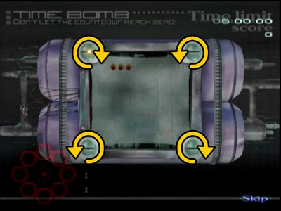

ピンは画像のとおりに移動させることで中央のゲージの移動量を最小化することができて、ゲージ移動の待ち時間を最も少なくすることができます。


この2箇所をクリアすると最大の難所であるパネル破壊パートが始まります。

#### ミス判定について

赤いパネルをレーザーで撃った場合は当然ミスになります。そして、**白いパネルを破壊したあとの空欄にレーザーを当ててもミスになります**。

それ以外の空欄ならパネルの隙間でも球体の外側でもミス判定にはなりません。**画面中央にある赤い球体部分もミス判定にはなりません**。ただの見た目だけの背景です。

  
▲ほぼ初期状態は隙間にレーザーを撃ってもミスにならない

これだけならそこまで難しくないと思いがちですが、白いパネルを破壊したあとの空欄は裏側からレーザーを当ててもミスになってしまいます。

つまり、**パネルを剥がせば剥がすほどミス判定になるエリアがどんどん増加する**ことになります。ある程度剥がしてしまうとパネルの隙間ですら危険な領域となってしまいます。


そして**2回のミスで強制的にゲームオーバーとなってしまう**ので、パネル破壊には細心の注意を払わなければなりません。

#### 赤いパネルについて

赤く点滅するパネルは点滅を3回行ったあとに隣接するパネルへ移動して再び3回の点滅を行うのを繰り返します。隣接するパネルがない場合は同じパネルで再度3回の点滅を行います。

2秒かけて3回点滅するので、**心の中で点滅間隔をカウントしながら**操作しましょう。

#### パターン変化

パネルの枚数が少なくなると**3秒間全てのパネルの点滅が収まります**。

そのあとから赤点滅パネルがランダムな位置へ出現するようになり、「2秒間かけて3回赤点滅」と「3秒間完全に消灯」の2とおりのパターンを繰り返すようになります。


#### 球体の端のパネル

パネルが残り僅かになると球体の縁のパネルを狙う必要がでてきますが、その場合はレーザーの当て方に注意しなければいけません。

球体の縁のパネルは側面でも

球体の端にあるパネルは、**球体の内側ではなく外側からレーザーを当てるように**しましょう。球体の内側はほぼミス判定領域になってしまっているので、外側からじわじわと当てることである程度安全にパネルを破壊することができます。

ただしパネルの表側が少しでも手前がわに回ってきていない状態では破壊できないので、手応えを感じない場合は即座にレーザーを打つのを止めましょう。


#### パネル破壊後

超執刀を発動してコアを破壊して終了です。うっかり赤いパネルに当ててしまわないように気をつけましょう。

-----


### 3-8 高度3000mの奇跡（ハード） ◆

!!! warning
    プレイ前に難易度を**ハード**に変更すること

このステージでは肺気胸が出現して約10秒後に揺れが発生します。揺れが発生している時に肺気胸等の患部が残っていた場合は悪化してしまうので、揺れが発生するまでに3つの肺気胸を治療する必要があります。肺気胸を合計12個処理すると閉創に移行します。

#### 肺気胸のパターン

肺気胸の出現パターンは4種類の中からランダムに選ばれます。図の赤丸で囲った部分の4点をメスで切ることによって、どのパターンか特定することが可能です。エコーで特定しても問題ありません。

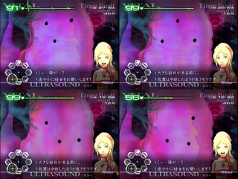


3カ所の肺気胸を完全に処理しても、揺れが発生するまでは次の肺気胸は出現しません。バイタル回復に努めたいところですが、揺れが発生している時に注射等の器具を使ってしまうとミス判定になってしまうのでほどほどにしておきましょう。

肺気胸の1～3セット目までは、**どれだけ早く処理しても揺れ発生までの時間は約10秒で固定です**。多少ミスしてもタイムに影響は出ませんが、4セット目は処理完了と同時に閉胸に移行するので可能な限り速く処理しましょう。

エコーで肺気胸の位置を特定する場合は3個所特定できる位置でエコーを使い、何も特定できなかったらもう1箇所をメスで切ることで特定可能です。エコーを使わずに4箇所全てにメスを入れるでも問題ないので好みの方法で処理しましょう。


!!! tip "TIPS"
    揺れの発生までの時間は難易度が高いほど短くなるので、このステージだけハードモードでプレイするとタイムが短くなります。

-----


### 3-10 許されざる研究

基本的な攻略は[ギルス攻略：テタルティ](./guilt.md#g3)を参照してください。

テタルティ初登場です。切開後とピンセットに持ち替えた時に長い**トーク待ち**が発生します。くさびを掴みそこねないように気を付けましょう。


## Chapter4 {#ch4}

### 4-2 血清を探せ！ ◆

!!! warning
    途中でESSをしてしまうと1人目からやり直しになってしまいます。また最後の手術後のテキストも短いのでESSは終始行わないようにしましょう。

#### マップ

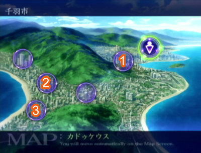

画像の順番どおりに進めることで、3種類のトリーティを重複することなく集めることができます。

#### トリーティ

トリーティは血清投与後にランダムな場所へ潜伏します。潜伏後すぐにエコーを利用してメスを走らせましょう。エコーを使った直後は画面上にトリーティの影が見えませんが、場所が合っていれば切り出すことが可能です。


#### ポインターの事前合わせ

ADVパートではポインターが表示されないのでマップ選択時には下記手順が必要になります。

1. マップ画面表示
2. ポインター表示待ち
3. ポインターを動かして場所を選択

この[2]と[3]の時間がややロスになってしまいます。

そこであらかじめ次の目的地をポインティングしたままリモコンを固定しておくことで、マップ表示と同時に目的地を選択することができるので、短いながらもタイム短縮になります。

  
▲エピソード開始時

  
▲一箇所目の手術でテーピング直後

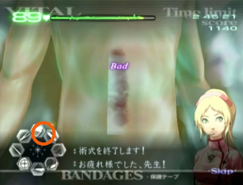  
▲二箇所目の手術でテーピング直後


-----


### 4-4 一人前

基本的な攻略は[ギルス攻略：トリーティ](./guilt.md#g4)を参照してください。

-----


### 4-6 最初の一刀 ◆

#### メス・レーザー・ゼリー

最初の3つの器具の使用指示は黒いモヤの上でポインターを動かさず、Aボタン押しっぱなしにした状態でスティックで器具を選び直すだけ大丈夫です。


#### 試薬投与1

右から順番に4つの試薬を投与していきます。3つ目の試薬を投与すると4つ目の試薬を投与完了するまで時間経過でバイタルが減少するようになってしまいます。

そして4つ目の試薬の投与が終わった後にバイタルが80以下になっていると、バイタルを回復するように指示が入ってしまいます。ペンプティが潜伏しそうな時に3つ目の試薬を投与すると潜伏中にバイタルを減らされてしまうことになるので、ペンプティが潜伏しそうなら試薬の投与はせずに待機するべきです。

以降も試薬の投与が続いて注射器の耐久力を切らしやすく、必ずどこかで回復を待たなければいけないのでここで回復しておくべきです。

#### 試薬投与2

2種類の試薬を投与するのに時間が空いてしまうと1種類目からやり直しになってしまいます。こちらも潜伏されるタイミングで1種類目の試薬を投与してしまうと潜伏後に時間切れになりやすいのでタイミングを図って投与する必要があります。

そして、試薬投与1からミスせず続けていると、ここで注射器の耐久力が切れてしまいます。タイミング調整も兼ねてどこかで耐久力を回復させましょう。


-----


### 4-7 新薬開発 ◆

パズル自体は簡単ですが、ピースを置く際に隣のヘクスに吸われてしまうことがあるので気をつけて置きましょう。


-----


### 4-8 次なる一手 ◆

ペンプティに試作血清を3回投与してからコアへレーザーを打ち込むのを2セット繰り返すだけのステージです。

最後にペンプティをメスで切除すれば閉創に移行します。次々と炎症を生成されてしまいますが無視してしまって構いません。

-----


### 4-9 新型レーザー開発

パズル2回目です。このステージから再びESSを利用するのを忘れないようにします。


-----


### 4-10 医師達の戦い

基本的な攻略は[ギルス攻略：ペンプティ](./guilt.md#g5)を参照してください。

このステージでは最初の出現パターンは6回目まで完全に固定されています。

1. 裂傷コア
2. ポリープコア
3. 腫瘍コア
4. 裂傷コア(ペンプティ本体浮上開始)
5. ポリープコア
6. 腫瘍コア
7. 以降ランダム

-----


## Chapter5 {#ch5}

### 5-2 テロ発生！ ◆

#### 一人目：キリアキ1体

1体のみの出現なので裂傷の先端へエコーを当ててすぐに特定します。

#### 一人目：追加キリアキ2体

別々の方向へ出現しやすく、このステージ内でも同時補足が難しい箇所です。無理せず1体ずつ補足しましょう。

バイタルを回復させずにそのままマザーを倒します。


#### 二人目：キリアキ2体

二人目の患者は術野が狭いです。こういった状況で2体同時に出現する時は、ほぼ同じタイミングで画面中央に戻って来るので**2体同時にエコーで捕捉する**ことを狙うことができます。


#### 二人目：追加キリアキ3体

3体同時に出現します。左のキリアキは方向が真上固定で、残りの2体は同じ位置から出現します。

3体同時補足も可能ですが、無理せずに2体同時補足した後に残り1体を補足するほうが安定しやすいです。


#### 三人目：キリアキ2体

3人目の患者は術野が左右に広いので、同時に出現しても画面中央に戻ってくるタイミングがズレやすくなっています。無理に同時に特定させるよりも、1体ずつ確実にエコーで捕捉したほうがタイムは縮みやすいです。

#### 三人目：追加キリアキ2体

左のキリアキは出現方向が真上固定です。右側のキリアキも真上方向に出現する場合はエコーによる同時特定を狙うことができます。

三人目を含めて、以降全てのマザーキリアキのお供として通常のキリアキが1体が追加されるようになります。バイタルを今までよりも多めに回復してから挑みましょう。

#### 四人目：キリアキ2体

二人目同様に術野が狭いのでエコーによる同時特定を狙うことができます。

#### 四人目：追加キリアキ2体

左下のキリアキは出現方向が真上固定となっています。右側のキリアキも真上方向に出現する場合はエコーによる同時特定を狙うことができます。

#### 五人目：キリアキ3体

3体同時出現ですが出現方向が固定されているキリアキがいません。3体同時に特定するのは難しいので、出現位置が同じキリアキ2体を同時に特定してから、残りの1体も特定しましょう。

#### 五人目：追加キリアキ2体

2体の出現位置が同じなのでエコーによる同時特定を狙うことができます。

-----


### 5-3 進化するギルス ◆

基本的な攻略は[ギルス攻略：テタルティ](./guilt.md#g3)を参照してください。

膜と楔の枚数が前回よりも増加しています。一気に摘出できない場合は超執刀を使いましょう。

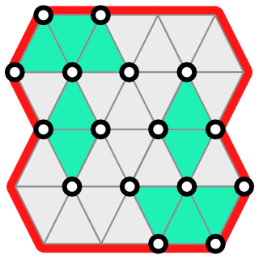

-----


### 5-4 続・進化するギルス

基本的な攻略は[ギルス攻略：トリーティ](./guilt.md#g4)を参照してください。

トリーティの対処方法は前回とまったく同じですが、必要な血清の投与量がほんの少しだけ増えています。血清の投与量をギリギリで狙っていると投与量が足りなくてもう一度注射することになるので注意しましょう。

-----


### 5-6 カドゥケウス感染 ◆

パラスケヴィ初登場です。基本的な攻略は[ギルス攻略：パラスケヴィ](./guilt.md#g6)を参照してください。

このステージは術野が広く、パラスケヴィが画面全体へ散らばりやすくなっています。散らばりすぎるとタイムが遅くなりかねないので、ここでは超執刀を使って一気に処理してしまいます。

分断したパラスケヴィ全てにメスを入れていって、最終的には最小サイズのパラスケヴィ16体を一度に相手にします。余計に画面全体に散らばりやすくなると思いがちですが、同じ移動経路を利用しやすいという習性と超執刀中のスローモーションのおかげで一箇所に固めやすくなります。

あとはまとめてピンセットで摘出すれば手術完了です。


!!! warning "処理落ち"
    大量のパラスケヴィに加えて裂傷も存在していると処理落ちが発生します。処理落ち中は縫合の折り返しが上手く判定されずに縫合として認識され辛いので確実な縫合操作が必要になります。


### 5-8 小さな悪魔

初期配置の裂傷をすべて縫合すると数秒後からサヴァト幼体が次々と出現するようになります。サヴァトの幼体が出現する間隔は**超執刀の影響を受けません**。

超執刀を使うことでレーザーでまとめて焼却しやすくなるという利点もあり、タイム的なロスはほとんどないので最初の幼体が出現する前に超執刀を使いましょう。

最後の2箇所から出現する幼体のみ、間を置かずに出現するので注意が必要です。


### 5-9 その名は死 ◆ {#ch5-9}

基本的な攻略は[ギルス攻略：サヴァト](./guilt.md#g7)を参照してください。

最終ステージとの違いは下記のとおりです。

- 糸の耐久力がかなり少ない
- 糸を放置しても赤くならない
- サヴァトのバリア耐久力が少ない
- サヴァトへメスを入れた際に幼体や患部が残っていると処理しなければいけない

ステージクリア後はエピソードリスト一番上に移動してチャプターZへ移行します。左端のサイドバーにポインタを乗せて、十字キーの上を押しっぱなしにしてください。


## ChapterZ {#chz}

### Z-1 FROM USA

最初に回収する骨片は**回収した順番どおりに**後からピンセットで配置していくことになります。可能なら毎回同じ順番で回収しましょう。

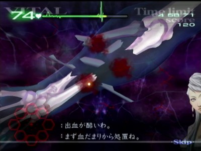

骨片をあてはめる際にはリモコンを少しひねって角度を合わせる必要があります。ひねる際にはポインターが意図しない位置に飛びやすいので、設置時にミスしないように気をつけましょう。

最後の骨片は設置位置へポインターをぴったり合わせられるなら**回転させずにそのまま設置することが可能です**。


!!! tips "&nbsp;"
    ほぼ同じ内容のステージがカドゥケウス NEW BLOODに登場しています


### Z-2 MAGIC

変異腫瘍は一つずつ摘出すると復活してしまうのでまとめて摘出する必要があります。

変異腫瘍は周囲にポリープを生成します。このポリープはレーザーで焼却するとランダムで血だまりを発生させてしまうので、血溜まりができているかどうかを確認してからゼリーとドレーンのどちらを使うか選択しましょう。

4つ同時に出現する時は、あらかじめポインタを合わせておくと少しだけドレーンが可能です。


!!! tips "&nbsp;"
    ほぼ同じ内容のステージがカドゥケウス NEW BLOODに登場しています


### Z-3 CHASE

ペンライトの光源のみで手術するステージです。

#### 開胸前

手術開始直後は**使用可能な器具が制限されています**。ペンライトで患部を照らすことで患部に対応する器具が可能となり、その状態で1つでも患部を処置することですべての器具が使用できるようになります。

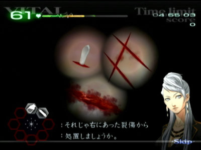

患部毎にペンライトを移動していては時間がかかってしまいます。下記画像の位置ならペンライトを動かすことなく患部の処置から切開までを行うことができるようになります。おすすめは切開ラインの端が見える右の画像です。

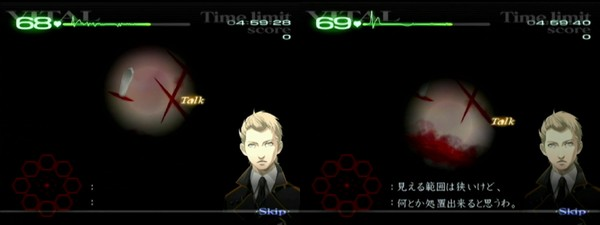


#### 肺下部

画面の遷移中に大裂傷とガラス片が見えるので位置を脳裏に焼き付けつつ最初に処理しましょう。

次に左上の裂傷を縫合します。**縫合中にペンライトアイコンとポインターが重なってしまうと縫合がキャンセルされてしまう**ので十分に注意しましょう。

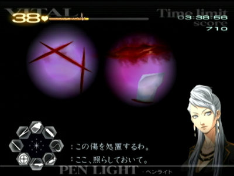

#### 肺上部

画面遷移後、操作可能になってから数秒後にライトが完全に消えてしまいます。本来はカメラのフラッシュを使いますが明るくなるまでに数秒待たなければならないので使わずに処置を進めます。

処置の順番は自由ですが、画面遷移中に左側に裂傷が見えるはずなので、まずは裂傷から処置したいところです。


### Z-4 TRANSPLANT

まずは2つ前のステージに登場した変異腫瘍2個を摘出します。摘出するだけでバイタルが瀕死になる上に、この先の臓器移植の過程でもさらにバイタルを減らされてしまうので、回復の手間を省くためにも腫瘍を摘出した後に超執刀を使いましょう。

収縮剤は動脈と静脈へそれぞれ注射器フル充填1.5回分ほどの量が必要です。注射する箇所はそれぞれの血管上ならどこでも大丈夫ですが、薬剤瓶のやや上あたりの血管が細いながらもすぐ近くなのでタイム短縮につながります。

動脈と静脈から発生する血溜まりについてはドレーンで同時に吸引することができます。その後の血管同士の吻合（ふんごう）は縫合の判定がとても狭いので折り返しを多めにして縫いましょう。


### Z-5 SAYONARA

このステージからキリアキの耐久力がレーザー1回分増加します。以降ラストステージまでのキリアキも当然増加しているのでレーザー2回で安心しないようにしましょう。

#### キリアキ

いきなりキリアキが3体出現します。3-2同様に術野が広いため、早めに特定しないと探すだけで時間を浪費してしまいます。バイタルは後でどうにでもなるのでキリアキが出現したら裂傷は放置してすぐにエコーで3体を特定しましょう。

全てのキリアキを処理して患部も治療するとサヴァト幼体が出現して長いトーク待ちが発生します。

#### 幼体+キリアキ

トーク待ちが終わったら超執刀を使います。キリアキが2体出現するのでこちらもエコーでの特定を優先します。

#### マザー

このステージではマザーキリアキにお供はついてきません。

マザーの処置まで完了するとサヴァト(幼体)を捕獲するための薬剤が使用可能になります。最低でも1匹捕獲すればいいので1匹だけ捕まえて、他2匹はレーザーで焼却してしまいましょう。

サヴァト（幼体）をレーザーで焼却した時は、人工膜へのゼリー同様に約1秒の間は画面遷移等が行われません。可能ならレーザーでの焼却は最初に行って、縫合や捕獲は最後に回しましょう。


## Chapter6 {#ch6}

### 6-3 感染リスク

基本的な攻略は[ギルス攻略：トリーティ](./guilt.md#g4)を参照してください。

3度目のトリーティは**出現時に色が見えない**特殊仕様になっています。

出現時に色が見えないということは**出現直後から血清を投与することができる**ということなので、このステージでは出現パターンを暗記することでタイムを短縮することができます。

なお、トリーティの移動速度がとても早いので注射はよく狙って打たないと相当数のミスが発生してしまいます。よく狙って注射を打ちましょう。


### 6-4 CALLING ME {#ch6-4}

ここでは5体のキリアキを同時に相手しなければなりません。回復の手間を省くためにも初期配置の裂傷を縫合したら超執刀を使用しましょう。

最初はキリアキ2体とパラスケヴィ(最小)2体が出現します。パラスケヴィを全て摘出すると追加のキリアキ3体とパラスケヴィ(最小)2体が出現します。再びパラスケヴィを摘出したら、残ったキリアキ5体を一気に処置しましょう。超執刀のエフェクトのおかげで潜伏状態のキリアキが視認しづらいので気をつけましょう。

その後はマザーキリアキとキリアキに加えてパラスケヴィ(耐久力2)2体が出現するので、これらを処置すれば手術終了となります。


### 6-6 ギルスと 未来と

基本的な攻略は[ギルス攻略：ペンプティ](./guilt.md#g5)を参照してください。

このステージのペンプティは各種コアを繰り出す間隔が短くなっています。その代わりに各種コアの耐久力がやや減少しているので、Chapter4の時よりも対処は容易ですが、一度コアを逃して患部を作られてしまうとリカバリーが難しい、という特徴があります。


### 6-7 英雄たちの屈辱

このステージでは患者毎に対応する執刀医が切り替わります。発揮される超執刀の効果も変わりますが、ステージを通して超執刀を合計2回使うことができます。

#### 1人目 テタルティ（担当：月森）

3人目のデフテラで超執刀を使いたいので可能な限り超執刀無しで突破したいです。手樽ティの楔を抜く過程でミスしてしまって余計に時間がかかりそうなら超執刀を使ってしまいましょう。

今までのテタルティよりも膜の枚数が多いので一度にすべて摘出するのは相当難しくなっています。2回に分けて摘出しましょう。

1.初期配置

- 緑の三角：テタルティの膜
- 丸：楔
- 赤枠：術野の境界（壁）で、この線の向こうにはテタルティは増殖しない


2.まずは右半分の膜5枚分の楔を全て抜きます。黄色の丸が引き抜く楔を表します。


3.次に左半分は膜を剥がしても増殖しないように壁側を除いて2辺の上に楔が存在しないように抜きます。今回の場合は2本だけです。

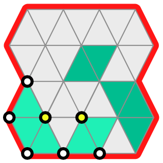

4.この状態になれば膜を剥がしても増殖しないので右側の膜を全て取り除きます。


5.残る左側について**楔がすべて生え揃うまで待ったら**全ての楔を抜いて膜もそのまま摘出します。

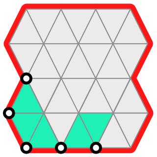

以上で手術完了です。操作に慣れてくると生え揃うのを待たずに残りも摘出することができます。

#### 2人目 キリアキ（担当：ミラ）

耐久力が増加したキリアキが出現します。それ以外は以前のキリアキ手術とほぼ変わりません。

さらに4人目では超執刀の使用をオススメできないのでここで使うとバイタルを気にする必要もなくなります。初期の大裂傷等を処置したらすぐに超執刀を使いましょう。

ここの追加のキリアキのみ出現条件が特殊で、**裂傷が残っていても最初のキリアキ2匹を倒した(Defeat)時**に追加の2体が現れる、となっています。


#### 3人目 デフテラ（担当：月森）

最初の血だまりは同時にドレーンできる場所が3箇所存在します。右の2個については判定がかなりシビアなので無理をして同時吸引を狙う必要はありません。

ここのデフテラは最初から2対が出現する上にランダムで血だまりが発生してしまいます。血溜まりが残っているとレーザーやドレーンを邪魔してしまうので優先的に吸い出さなければいけません。

デフテラの機嫌次第ではバイタルを0にされてもおかしくないので、同色融合が頻発して回復が追いつかなくなったような場合は迷わず超執刀を使って回復に努めましょう。

#### 4人目 パラスケヴィ（担当：ミラ）

基本的にはChapter5の時と一緒ですが、**1匹でも体内に潜られると即ゲームオーバー**になってしまいます。分割のしすぎには注意しましょう。また、執刀医はミラになるので月森の超執刀を使うこともできません。正攻法で対処していくことになります。

ミラの超執刀を使えばバイタルの心配は無くなりますが、**超執刀のエフェクトのせいでパラスケヴィの視認が困難になる**という弊害があるので使用はオススメしません。

ピンセットで掴み損ねるなどの操作ミスをしなければバイタルは間に合うようになっているので落ち着いてプレイしましょう。

-----


### 6-8 医神の最期

基本的な攻略は[ギルス攻略：サヴァト](./guilt.md)を参照してください。

#### 糸切断フェイズ

[5-9](#ch5-9)同様にツールグリッチを利用して糸を切断していきますが、糸の耐久度が大幅に上昇しています。

#### VSサヴァト phase1 (月森)

ここからは月森とミラの2人で交互に手術していきます。サヴァトへダメージを与えきった後に裂傷や幼体の後処理をする必要が無いので、サヴァトへダメージを与えることに専念できます。ただし、**バイタルの数値は継続する**ので完全に放置していいわけでもありません。特にサヴァトの幼体が合体してしまうとバイタルを半分にされてしまいます。幼体は優先的に処理しましょう。

#### VSサヴァト phase2 (ミラ)

ミラで手術中のみ超執刀を使用しても問題ないので一気にバイタルを回復するチャンスとなります。

裂傷を2・3個COOL判定で縫合するだけでバイタルが完全に回復するので、可能な限りバイタル全快の状態で次の段階へ移行したいです。

#### VSサヴァト phase3 (月森)

サヴァトのバリアは最初にOKを出すまでが最も耐久力が高いので、ミラでバイタルを全快にしたのならバイタル回復は最小限にしてレーザーで攻撃しましょう。

最後に血清を打つ際はバイタルが31以上になってるのを確認してから打ち、最後の超執刀を処理落ちしないように発動すれば手術終了です。


## 参考

- [:octicons-link-external-16: カドゥケウスZ 2つの超執刀 -攻略術式集-](https://szsk.github.io/data/tcso/)
- [:octicons-link-external-16: カドゥケウスZ 2つの超執刀 Any% Normal Speedrun 1:17:55.27](https://www.youtube.com/watch?v=DPVx8icf84A)
- [:octicons-link-external-16: Speedrun.com カドゥケウスZ](https://www.speedrun.com/tcso)


## LiveSplit用チャプターリスト

``` text
1-1 執刀の心得 ◆
1-2 続・執刀の心得 ◆
1-3 別れの手術 ◆
1-5 哀愁の歌うたい
1-6 医師の資格
1-8 生か、死か
2-1 眠れる力
2-3 神の手を目指して ◆
2-4 神の手の覚醒
2-6 生きたくない。 ◆
2-9 生きたい。
2-11 君のため、皆のため
3-2 ギルス ◆
3-4 かけがえのない物
3-6 最悪の患者
3-8 H 高度3000mの奇跡 ◆
3-10 許されざる研究
4-2 血清を探せ！ ◆
4-4 一人前
4-6 最初の一刀 ◆
4-7 新薬開発 ◆
4-8 次なる一手 ◆
4-9 新型レーザー開発
4-10 医師達の戦い
5-2 テロ発生！ ◆
5-3 進化するギルス ◆
5-4 続・進化するギルス
5-6 カドゥケウス感染
5-8 小さな悪魔
5-9 その名は死 ◆
Z-1 FROM USA
Z-2 MAGIC
Z-3 CHASE ◆
Z-4 TRANSPLANT
Z-5 SAYONARA
6-3 感染リスク
6-4 CALLING ME
6-6 ギルスと 未来と
6-7 英雄たちの屈辱
6-8 医神の最期
エピローグ
```